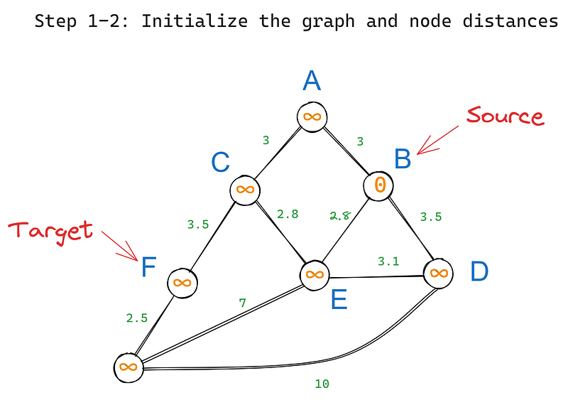
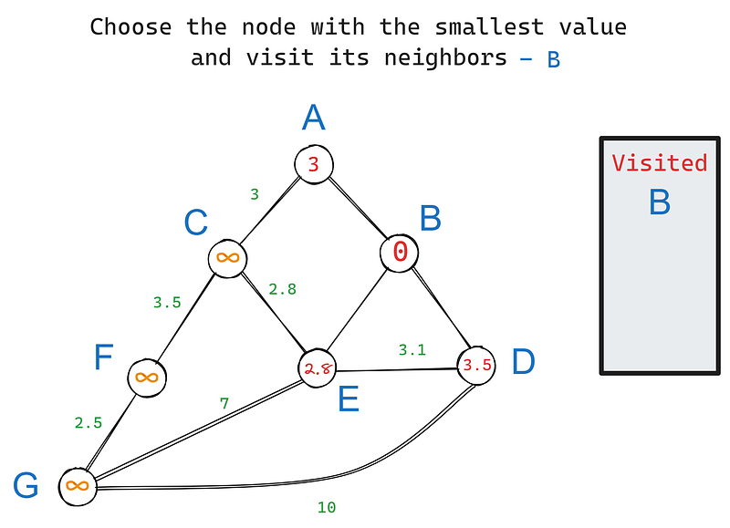
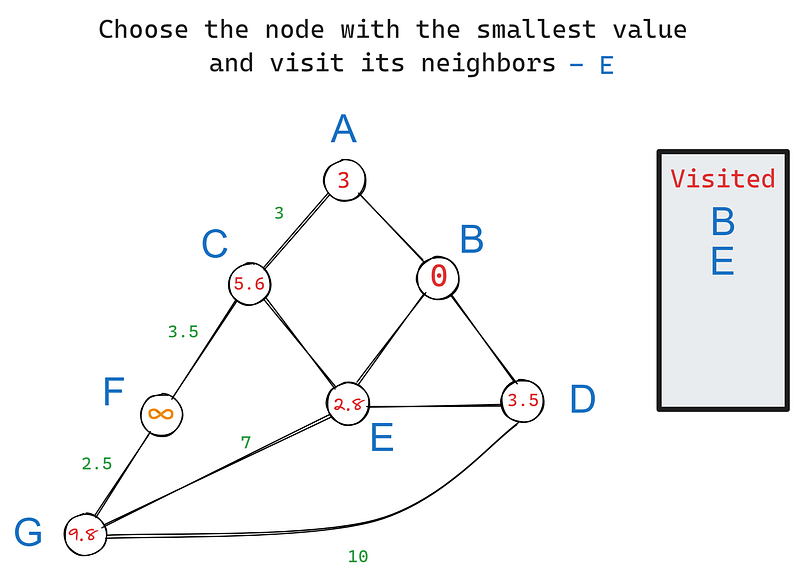
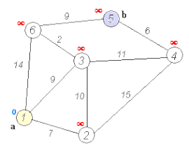
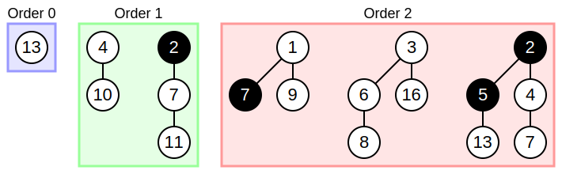
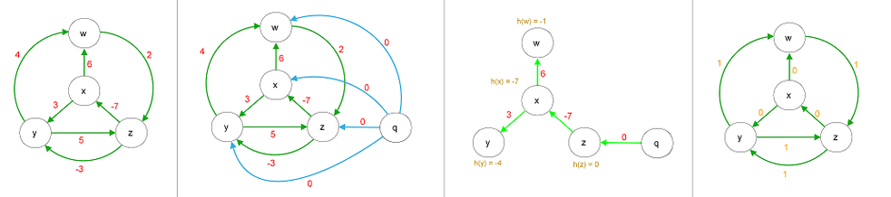
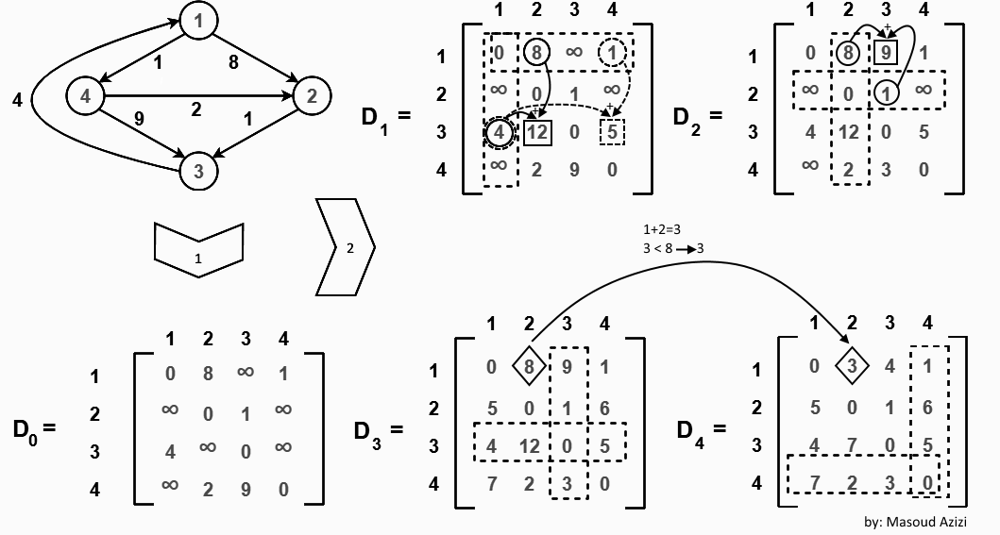

## Análisis de Riesgo

Al realizar este trabajo sobre algoritmos de camino más corto, podría encontrarme con varios problemas que dificulten el desarrollo del proyecto:

1.  **Incompatibilidad de Librerías**: Podría suceder que las versiones de las librerías utilizadas (como `networkx`, `numpy`, `scipy`, etc.) no sean compatibles entre sí, lo que generaría errores difíciles de depurar. Sería crucial asegurarme de que todas las librerías estén actualizadas y sean compatibles.

2.  **Complejidad Computacional**: Al trabajar con grafos grandes, los algoritmos de camino más corto pueden volverse extremadamente lentos y consumir una gran cantidad de memoria. Debería optimizar mi código y considerar el uso de estructuras de datos eficientes para manejar grafos de gran tamaño, aun así existe el riesgo de que mi pc se congele.

3.  **Conversión a PDF**: Pasar un notebook a PDF puede ser tedioso y problemático, especialmente si contiene gráficos y visualizaciones complejas. Debería asegurarme de que todas las celdas se rendericen correctamente y de que el formato final sea legible y profesional.

## Justificación Técnica de Herramientas y Lenguajes

En este proyecto se han utilizado diversas herramientas y lenguajes de programación para abordar el problema de encontrar caminos más cortos en grafos. A continuación, se presenta una justificación técnica de las herramientas y lenguajes empleados:

1.  **Python**:
    -   **Bibliotecas Especializadas**: Python cuenta con una amplia gama de bibliotecas especializadas para el análisis y manipulación de grafos, como `networkx`, `numpy`, `scipy`, y `matplotlib`, que simplifican el desarrollo y la visualización de soluciones.
2.  **NetworkX**:
    -   **Manipulación de Grafos**: `networkx` es una biblioteca de Python diseñada para la creación, manipulación y estudio de la estructura, dinámica y funciones de grafos complejos. Permite una fácil implementación y análisis de grafos.
    -   **Algoritmos Integrados**: Proporciona una variedad de algoritmos integrados para el análisis de grafos, incluyendo algoritmos de caminos más cortos, lo que facilita la implementación y comparación de diferentes métodos.
3.  **NumPy**:
    -   **Eficiencia Computacional**: `numpy` es una biblioteca fundamental para la computación científica en Python. Proporciona soporte para arrays y matrices multidimensionales, junto con una colección de funciones matemáticas de alto nivel para operar con estos arrays.
    -   **Manejo de Datos**: Facilita el manejo y la manipulación eficiente de grandes conjuntos de datos, lo cual es crucial para el análisis de grafos y la implementación de algoritmos de caminos más cortos.
4.  **SciPy**:
    -   **Algoritmos Avanzados**: `scipy` es una biblioteca de Python utilizada para la computación científica y técnica. Incluye módulos para la optimización, álgebra lineal, integración, interpolación, funciones especiales, y más.
    -   **Algoritmos de Grafos**: Proporciona implementaciones eficientes de algoritmos de caminos más cortos, como Dijkstra, Bellman-Ford, Johnson y Floyd-Warshall, lo que permite comparar el rendimiento y la eficiencia de diferentes métodos.
5.  **Matplotlib**:
    -   **Visualización de Grafos**: `matplotlib` es una biblioteca de Python utilizada para crear visualizaciones estáticas, animadas e interactivas. Se ha utilizado para visualizar los grafos y sus propiedades de manera clara y comprensible.
    -   **Flexibilidad y Personalización**: Permite una gran flexibilidad y personalización en la creación de gráficos, lo que facilita la representación visual de los resultados del análisis de grafos.
6.  **Visual Studio Code**:
    -   **Entorno de Desarrollo Integrado (IDE)**: Visual Studio Code es un editor de código fuente desarrollado por Microsoft. Ofrece soporte para la depuración, control de versiones, y una amplia gama de extensiones que mejoran la productividad.
    -   **Facilidad de Uso**: Su interfaz intuitiva y personalizable facilita el desarrollo y la gestión de proyectos de programación, incluyendo aquellos que involucran análisis de grafos y algoritmos complejos.
7.  **Jupyter Notebook (Dentro de VSCode)**:
    -   **Documentación y Reproducibilidad**: Facilita la documentación del flujo de trabajo y la reproducibilidad de los experimentos, permitiendo a otros investigadores seguir y replicar los resultados obtenidos.
8.  **Scribbr Citation Generator**:
    -   **Generación de Citas y Referencias**: Scribbr Citation Generator es una herramienta en línea que facilita la creación de citas y referencias, en este caso Harvard.
9.  **RStudio**:
    -   **Exportación**: Permite la creación de documentos `HTML` con tabla de contenidos de manera que el usuario puede navegar por el documento con facilidad. Además permite exportarlo a PDF aunque esto empeora la experiencia del usuario.

## Tipos de datos básicos empleados en el proyecto

1.  lista: Representa una secuencia de nodos o vértices del grafo.

    -   Ejemplo: vertices = ['A', 'B', 'C']

2.  diccionario: Representa un mapa de adyacencia entre los nodos del grafo.

    -   Ejemplo: grafo = {'A': ['B', 'C'], 'B': ['A', 'D'], 'C': ['A', 'F'], 'D': ['B'], 'E': ['F'], 'F': ['C', 'E']}

3.  set: Representa un conjunto de nodos o vértices del grafo.

    -   Ejemplo: vertices = {'A', 'B', 'C'}

4.  tupla: Similar a la lista, pero inmutable.

    -   Ejemplo: vertices = ('A', 'B', 'C')

5.  numpy.ndarray: Representa una matriz de adyacencia entre los nodos del grafo. Tienen la misma función que los arrays normales pero son más veloces y facilitan los calculos con diversas funciones.

    -   Ejemplo: grafo = np.array([[0, 1, 0], [1, 0, 1], [0, 1, 0]])

6.  scipy.sparse.csr_matrix: Representa una matriz dispersa en formato CSR (Compressed Sparse Row), que es eficiente para operaciones aritméticas y de almacenamiento.

    -   Ejemplo: matriz_adyacencia = csr_matrix([[0, 1, 0], [1, 0, 1], [0, 1, 0]])

7.  int: Representa un número entero.

    -   Ejemplo: num_nodos = 14

### Creación de una Matriz de adyacencia y representación gráfica del grafo

Se utlizará para medir el tiempo de ejecución de distintos algoritmos

```{python include=FALSE}
# Importar librerias
import subprocess
import sys

def install(package):
    subprocess.check_call([sys.executable, "-m", "pip", "install", package])

try:
    import numpy as np
except ImportError:
    install('numpy')
    import numpy as np

try:
    import networkx as nx
except ImportError:
    install('networkx')
    import networkx as nx

try:
    import matplotlib.pyplot as plt
except ImportError:
    install('matplotlib')
    import matplotlib.pyplot as plt

try:
    import random
except ImportError:
    install('random')
    import random

try:
    from scipy.sparse import csr_matrix
except ImportError:
    install('scipy')
    from scipy.sparse import csr_matrix
```

plt.figure(figsize=(11, 6))

\# Número de nodos

num_nodos = len(G.nodes)

\# Calcular las posiciones en forma de elipse

pos = {}

for i in range(num_nodos):

angle = 2 \* np.pi \* i / num_nodos

x = np.cos(angle)

y = np.sin(angle)

pos[i] = (x, y)

\# Dibujar nodos y aristas

nx.draw(G, pos, with_labels=True, node_color='lightblue', edge_color='gray', node_size=1500, font_size=20)

\# Obtener los pesos de las aristas

edge_labels = nx.get_edge_attributes(G, 'weight')

\# Dibujar los pesos de las aristas

nx.draw_networkx_edge_labels(G, pos, edge_labels=edge_labels, font_color='darkblue', font_size=7)

plt.gca().set_facecolor('#606060')

plt.show()

```{python}
np.random.seed(2706)

# Crea una gráfica vacía
G = nx.Graph()

# Agrega 20 nodos a la gráfica
for i in range(14):
    G.add_node(i)

# Añade aristas a la gráfica
G.add_edge(0, 3)
G.add_edge(3, 6)
G.add_edge(6, 9)
G.add_edge(9, 10)
G.add_edge(0, 2)
G.add_edge(2, 5)
G.add_edge(5, 8)
G.add_edge(8, 10)
G.add_edge(0, 1)
G.add_edge(1, 4)
G.add_edge(4, 7)
G.add_edge(7, 10)
G.add_edge(3, 6)
G.add_edge(6, 9)
G.add_edge(9, 13)
G.add_edge(13, 10)
G.add_edge(12, 9)
G.add_edge(12, 11)
G.add_edge(11, 10)

# Calcula la matriz de adyacencia actualizada
matriz_adyacencia = nx.to_numpy_array(G)

# Asigna pesos a las aristas de forma sesgada
matriz_adyacencia[matriz_adyacencia == 1] = np.random.randint(1, 5, size=np.count_nonzero(matriz_adyacencia == 1))
matriz_adyacencia[matriz_adyacencia == 0] = np.random.randint(10, 110, size=np.count_nonzero(matriz_adyacencia == 0))
matriz_adyacencia[matriz_adyacencia > 20] = 0
np.fill_diagonal(matriz_adyacencia, 0)
print(matriz_adyacencia)
matriz_adyacencia = csr_matrix(matriz_adyacencia)

# Crear un grafo desde la matriz de adyacencia
G = nx.from_numpy_array(matriz_adyacencia.toarray())

import matplotlib.style as style
import matplotlib.colors as mcolors

# Definir las opciones del estilo
style_params = {
    'axes.facecolor': '#E5E5E5',  # Color de fondo para los ejes
    'figure.facecolor': '#E5E5E5',  # Color de fondo para la figura
}

# Aplicar el estilo personalizado
plt.style.use('fivethirtyeight')  # Establecer un estilo base
style_params.update({
    'axes.edgecolor': '#AAAAAA',  # Color del borde de los ejes
    'grid.color': '#AAAAAA',  # Color del grid
    'grid.linestyle': '--',  # Estilo del grid
    'grid.linewidth': 0.5,  # Ancho del grid
})

# Aplicar el estilo personalizado


# Dibujar el grafo con nodos en forma de elipse

plt.figure(figsize=(11, 6))

# Número de nodos
num_nodos = len(G.nodes)
# Calcular las posiciones en forma de elipse
pos = {}
for i in range(num_nodos):
    angle = 2 * np.pi * i / num_nodos
    x = np.cos(angle)  
    y = np.sin(angle)
    pos[i] = (x, y)

# Dibujar nodos y aristas
nx.draw(G, pos, with_labels=True, node_color='lightblue', edge_color='gray', node_size=1500, font_size=20)

# Obtener los pesos de las aristas
edge_labels = nx.get_edge_attributes(G, 'weight')

# Dibujar los pesos de las aristas
nx.draw_networkx_edge_labels(G, pos, edge_labels=edge_labels, font_color='darkblue', font_size=7)

plt.show()
```

### Creación de una función para desglosar el camino

```{python}
# Función para trazar el camino desde un nodo dado hasta el nodo de inicio utilizando el array de predecesores
def trazar_camino(predecesores, nodo_inicio, nodo_fin):
    camino = []
    nodo_actual = nodo_fin
    while nodo_actual != nodo_inicio:
        camino.append(nodo_actual)
        nodo_actual = predecesores[nodo_actual]
    camino.append(nodo_inicio)
    camino.reverse()
    return camino
```

## Algoritmos de ruta más corta

### Dijkstra con Montículos de Fibonacci

Para esta variante del algoritmo primero se explicará el algoritmo base de `Dijkstra` y posteriormente la estructura de datos de `Montículos de Fibonacci`

#### Dijkstra

##### Características:

1.  **Aplicabilidad**: Funciona en grafos dirigidos y no dirigidos.
2.  **Pesos Positivos**: Solo funciona con grafos que tienen pesos no negativos en las aristas.
3.  **Complejidad Temporal**: $O(V^2)$, donde $V$ es el número de vértices en el grafo.

##### Pasos:

1.  **Inicialización**:

    -   Establece la distancia al nodo origen como 0 y a todos los demás nodos como infinito.
    -   Marca todos los nodos como no visitados. Establece el nodo origen como el nodo actual.

2.  **Selección del Nodo Actual**:

    -   Selecciona el nodo no visitado con la distancia más pequeña como el nodo actual.

    

    Fuente: [Datacamp](https://www.datacamp.com/tutorial/dijkstra-algorithm-in-python)

3.  **Actualización de Distancias**:

    -   Para el nodo actual, considera todos sus vecinos no visitados y calcula sus distancias tentativas.
    -   Compara la distancia recién calculada con la distancia actual asignada y asigna el menor valor.

    

    Fuente: [Datacamp](https://www.datacamp.com/tutorial/dijkstra-algorithm-in-python)

4.  **Marcar Nodo como Visitado**:

    -   Una vez considerados todos los vecinos del nodo actual, marca el nodo actual como visitado. Un nodo visitado no será revisado nuevamente.

    

    Fuente: [Datacamp](https://www.datacamp.com/tutorial/dijkstra-algorithm-in-python)

5.  **Repetición**:

    -   Si el nodo destino ha sido marcado como visitado o si la distancia más pequeña entre los nodos no visitados es infinita, el algoritmo termina.
    -   De lo contrario, selecciona el nodo no visitado con la distancia más pequeña, establece este nodo como el nuevo nodo actual y repite el proceso.\
        \
        Fuente: [Wikipedia](https://es.wikipedia.org/wiki/Algoritmo_de_Dijkstra)

**Referencias:**

-   M, G.P. (2023) Explicación de algoritmos y estructuras de datos de grafos con Ejemplos en Java y C++. <https://www.freecodecamp.org/espanol/news/explicacion-de-algoritmos-y-estructuras-de-datos-de-grafos-con-ejemplos-en-java-y-c/>.

-   colaboradores de Wikipedia (2024) Algoritmo de Dijkstra. <https://es.wikipedia.org/wiki/Algoritmo_de_Dijkstra>.

-   Tuychiev, B. (2024) Implementing the Dijkstra Algorithm in Python: A Step-by-Step Tutorial. <https://www.datacamp.com/tutorial/dijkstra-algorithm-in-python>.

```{python}
def dijkstra_algorithm(graph, start_node):
    unvisited_nodes = list(graph.nodes)  # Cambio de metodo de nodos

    # We'll use this dict to save the cost of visiting each node and update it as we move along the graph   
    shortest_path = {}
 
    # We'll use this dict to save the shortest known path to a node found so far
    previous_nodes = {}
 
    # We'll use max_value to initialize the "infinity" value of the unvisited nodes   
    max_value = sys.maxsize
    for node in unvisited_nodes:
        shortest_path[node] = max_value
    # However, we initialize the starting node's value with 0   
    shortest_path[start_node] = 0
    
    # The algorithm executes until we visit all nodes
    while unvisited_nodes:
        # The code block below finds the node with the lowest score
        current_min_node = None
        for node in unvisited_nodes: # Iterate over the nodes
            if current_min_node == None:
                current_min_node = node
            elif shortest_path[node] < shortest_path[current_min_node]:
                current_min_node = node
                
        # The code block below retrieves the current node's neighbors and updates their distances
        neighbors = graph.neighbors(current_min_node)
        for neighbor in neighbors:
            tentative_value = shortest_path[current_min_node] + graph[current_min_node][neighbor].get('weight', 1)
            if tentative_value < shortest_path[neighbor]:
                shortest_path[neighbor] = tentative_value
                # We also update the best path to the current node
                previous_nodes[neighbor] = current_min_node
 
        # After visiting its neighbors, we mark the node as "visited"
        unvisited_nodes.remove(current_min_node)
    
    return previous_nodes, shortest_path

# Test the function
previous_nodes, shortest_path = dijkstra_algorithm(G, 0)
print("Previous nodes:", previous_nodes)
print("Shortest path:", shortest_path)
```

**Referencias:**\
- Klochay, A. (2022) Implementing Dijkstra’s algorithm in Python. <https://www.udacity.com/blog/2021/10/implementing-dijkstras-algorithm-in-python.html>

*Nota: tuve que cambiar la función original para obtener los nodos por la que utiliza `NetworkX` actualmente*

#### Montículos de Fibonacci

##### Características

1.  **Completo**: Es un árbol binario completo, lo que significa que todos sus niveles están completamente llenos, excepto el último nivel, que está lleno desde la izquierda a la derecha.

2.  **Árbol binario**: Cada nodo tiene como máximo dos hijos (izquierdo y derecho).

3.  **Raíz**: El nodo raíz es el elemento más grande del montículo.

4.  **Propiedad de Fibonacci**: La propiedad clave del montículo de Fibonacci es que para cualquier nodo, la cantidad de nodos en su subárbol izquierdo es igual a la cantidad de nodos en su subárbol derecho, o uno menos.

5.  **Organización de los pesos**: El peso más pequeños se pone a la izquierda y el mayor a la derecha.

    -   **Ejemplo**:

| Peso 1 | Peso 2 | Peso que va a la izquierda |
|--------|--------|----------------------------|
| 2      | 5      | 2                          |
| 1      | -4     | -4                         |
| -7     | -2     | -7                         |



Fuente: [Growingwiththeweb](https://www.growingwiththeweb.com/data-structures/fibonacci-heap/overview/)

##### Insertar

**Paso 1: Verificar si el árbol está vacío**

-   Si el árbol está vacío (no hay nodos), crea un nuevo nodo con el elemento que se desea insertar y establece ese nodo como la raíz del árbol.

**Paso 2: Identificar el lugar correcto para insertar el elemento**

-   Comienza en la raíz del árbol.
-   Mientras que el elemento a insertar es mayor que el valor del nodo actual, sigue hacia la derecha (hacia el hijo derecho).
-   Si el elemento a insertar es menor que el valor del nodo actual, sigue hacia la izquierda (hacia el hijo izquierdo).

**Paso 3: Insertar el elemento en el lugar correcto**

-   Una vez que se ha encontrado el lugar correcto para insertar el elemento, crea un nuevo nodo con ese elemento.
-   Si el lugar correcto es una hoja (un nodo sin hijos), coloca el nuevo nodo allí.

**Paso 4: Reorganizar el árbol si es necesario**

-   Si el nuevo nodo tiene dos hijos, reorganiza el árbol para mantener la propiedad de Fibonacci:
-   Si el nuevo nodo tiene un hijo izquierdo y su subárbol derecho tiene más nodos que su subárbol izquierdo, intercambia los hijos del nuevo nodo.
-   Repite este proceso hasta que se cumpla la propiedad de Fibonacci.

**Paso 5: Actualizar la raíz si es necesario**

-   Si el nuevo nodo se convirtió en la nueva raíz del árbol (es decir, se movió hacia arriba), actualiza la raíz del árbol con el nuevo nodo.

**Ejemplo:**

Supongamos que tenemos un montículo de Fibonacci vacío y queremos insertar los elementos 5, 3, 7 y 2 en ese orden.

```         
                                             5
                                            / \
                                           3   7
                                          /
                                         2
```

1.  **Insertar 5:**
    -   Crea un nuevo nodo con valor 5 y lo establece como la raíz del árbol.
2.  **Insertar 3:**
    -   Identifica el lugar correcto para insertar 3 (izquierda de 5).
    -   Crea un nuevo nodo con valor 3 y lo coloca en ese lugar.
    -   Reorganiza el árbol: no es necesario porque 3 tiene solo un hijo izquierdo.
3.  **Insertar 7:**
    -   Identifica el lugar correcto para insertar 7 (derecha de 5).
    -   Crea un nuevo nodo con valor 7 y lo coloca en ese lugar.
    -   Reorganiza el árbol: no es necesario porque 7 tiene solo un hijo derecho.
4.  **Insertar 2:**
    -   Identifica el lugar correcto para insertar 2 (izquierda de 3).
    -   Crea un nuevo nodo con valor 2 y lo coloca en ese lugar.
    -   Reorganiza el árbol: no es necesario porque 2 tiene solo un hijo izquierdo.

El resultado final es:

```         
                                            5
                                           / \
                                          3   7
                                         /
                                        2
```

##### Eliminar

**Paso 1: Identificar el nodo a eliminar**

-   Busca el nodo que contiene el elemento que se desea eliminar.

**Paso 2: Verificar si el nodo tiene hijos**

-   Si el nodo a eliminar no tiene hijos, simplemente elimina ese nodo del árbol.
-   Si el nodo a eliminar tiene un hijo izquierdo y un hijo derecho, sigue con el siguiente paso.

**Paso 3: Reemplazar el nodo a eliminar con su hijo derecho**

-   Si el nodo a eliminar tiene un hijo derecho, reemplaza el nodo a eliminar con su hijo derecho.
-   Si el nodo a eliminar no tiene un hijo derecho, pero sí un hijo izquierdo, reemplaza el nodo a eliminar con su hijo izquierdo.

**Paso 4: Reorganizar el árbol si es necesario**

-   Si se reemplazó el nodo a eliminar con su hijo derecho o izquierdo, puede que sea necesario reorganizar el árbol para mantener la propiedad de Fibonacci:
-   Si el nuevo nodo tiene un hijo izquierdo y su subárbol derecho tiene más nodos que su subárbol izquierdo, intercambia los hijos del nuevo nodo.
-   Repite este proceso hasta que se cumpla la propiedad de Fibonacci.

**Paso 5: Actualizar la raíz si es necesario**

-   Si el nuevo nodo se convirtió en la nueva raíz del árbol (es decir, se movió hacia arriba), actualiza la raíz del árbol con el nuevo nodo.

Aquí hay un ejemplo para ilustrar estos pasos:

Supongamos que tenemos un montículo de Fibonacci con los nodos 5, 3, 7 y 2 en ese orden y queremos eliminar el elemento 3.

1.  **Identificar el nodo a eliminar**: El nodo 3 es el que se desea eliminar.
2.  **Verificar si el nodo tiene hijos**: El nodo 3 tiene un hijo izquierdo (el nodo 2).
3.  **Reemplazar el nodo a eliminar con su hijo derecho**: No hay un hijo derecho para el nodo 3, pero sí un hijo izquierdo (el nodo 2). Sin embargo, no se reemplaza el nodo 3 con el nodo 2 porque el nodo 2 tiene un hijo izquierdo. En lugar de eso, se sigue con el siguiente paso.
4.  **Reorganizar el árbol si es necesario**: El nuevo nodo (el nodo 2) tiene un hijo izquierdo y su subárbol derecho tiene más nodos que su subárbol izquierdo. Se intercambian los hijos del nuevo nodo para mantener la propiedad de Fibonacci.
5.  **Actualizar la raíz si es necesario**: No hay necesidad de actualizar la raíz porque el nuevo nodo (el nodo 2) no se convirtió en la nueva raíz.

El resultado final es:

```         
                                            5
                                           / \
                                          7   2
                                         /
                                        3
```

Sin embargo, como queremos eliminar el elemento 3, seguimos con los pasos restantes.

6.  **Identificar el nodo a eliminar:** El nodo 3 es el que se desea eliminar.
7.  **Verificar si el nodo tiene hijos:** El nodo 3 no tiene hijos.
8.  **Reemplazar el nodo a eliminar con su hijo derecho:** No hay un hijo derecho para el nodo 3, por lo que simplemente se elimina el nodo 3 del árbol.

El resultado final es:

```         
                                            5
                                           / \
                                          7   2
```

En resumen, la eliminación de un elemento en un montículo de Fibonacci implica reemplazar el nodo a eliminar con su hijo derecho o izquierdo y luego reorganizar el árbol para mantener la propiedad de Fibonacci.

**Complejidad temporal**

$O(log n)$, donde $n$ es el número de nodos en el árbol. Esto se debe a que el árbol está ordenado, lo que hace que la búsqueda sea muy eficiente.

**Complejidad espacial**

$O(1)$, ya que solo necesitamos acceder a los nodos del árbol para realizar la búsqueda.

##### Ventajas

1.  **Búsqueda eficiente**: La búsqueda es muy rápida debido a la estructura del árbol binario completo.
2.  **Inserción y eliminación eficientes**: Estas operaciones se realizan en tiempo $O(log n)$, lo que es más rápido que en otros tipos de árboles binarios.
3.  **Estructura compacta**: Reduce el uso de memoria.

##### Desventajas

1.  **Complejidad de implementación**: Puede ser más costoso de implementar que otros tipos de árboles binarios.
2.  **Requerimientos de mantenimiento**: Requiere un mantenimiento constante para asegurarse de que está correctamente ordenado.

**Referencias**

-   Colaboradores de Wikipedia (2024) Montículo de Fibonacci. <https://es.wikipedia.org/wiki/Mont%C3%ADculo_de_Fibonacci>.
-   Fibonacci heap (2018). <https://www.growingwiththeweb.com/data-structures/fibonacci-heap/overview/>.

```{python}
#%%timeit
from scipy.sparse.csgraph import dijkstra
# Utiliza el algoritmo de Dijkstra a través de scipy
dist_matrix, predecessors = dijkstra(matriz_adyacencia, directed=False, indices=0, return_predecessors=True)

# Ruta del nodo 0 al 13
camino = trazar_camino(predecessors, 0, 13)

print("El camino desde el nodo 0 hasta el nodo 13 es:", camino)
print("La distancia mínima entre el nodo 0 y el nodo 13 es:", dist_matrix[13])
print('Tiempo medio de ejecución: 363 microsegundos')
```

#### Dijkstra en Montículos de Fibonacci

##### Caracteristicas

**Pesos negativos:** Utilizar esta estructura de datos con Dijkstra permite el uso de este algoritmo en grafos con pesos negativos al mantener una estructura ordenada.

Complejidad temporal: Pasa de $O(N^2)$ a $O[N(N*k + N\log(N))]$

-   $N$ es el número de nodos en el grafo

-   $k$ es el número promedio de aristas conectadas por nodo

Explicación complejidad temporal:

-   La operación de insertar un nuevo nodo en el montículo de Fibonacci tiene una complejidad temporal de $O(log N)$

-   La operación de extraer el nodo con la distancia más corta del montículo de Fibonacci también tiene una complejidad temporal de $O(log N)$

-   El algoritmo de Dijkstra necesita realizar estas operaciones para cada uno de los N nodos, lo que da como resultado una complejidad temporal total de $O[N log N]$

Sin embargo, en el peor caso, la operación de insertar un nuevo nodo en el montículo de Fibonacci puede requerir actualizar la distancia de todos los nodos adyacentes, lo que da como resultado una complejidad temporal adicional de $O(N*k)$

Por lo tanto, la complejidad temporal total es $O[N(N*k + N log(N))]$

**Paso 1: Inicialización**

-   Se inicializa un montículo de Fibonacci con todos los nodos del grafo y sus respectivos pesos.
-   Se selecciona el nodo de partida (el nodo desde el que se desea encontrar la ruta más corta).
-   Se establece el peso del nodo de partida como 0, ya que es el punto de partida.

**Paso 2: Buscar el nodo con el peso más bajo**

-   Se busca el nodo con el peso más bajo en el montículo de Fibonacci.
-   Si se encuentra un nodo con un peso menor que el peso actual del nodo de partida, se actualiza el peso del nodo de partida y se selecciona como nuevo nodo de partida.

**Paso 3: Actualizar los pesos**

-   Se actualizan los pesos de los nodos adyacentes al nodo de partida.
-   Si un nodo tiene un peso menor que el peso actual del nodo de partida, se actualiza el peso del nodo y se selecciona como nuevo nodo de partida.

**Paso 4: Repetir**

-   Se repite el proceso de buscar el nodo con el peso más bajo y actualizar los pesos hasta que se haya visitado todos los nodos del grafo.
-   Cuando se ha visitado todos los nodos, se ha encontrado la ruta más corta desde el nodo de partida hasta cada uno de los demás nodos.

**Paso 5: Recuperar la ruta**

-   Se recupera la ruta más corta desde el nodo de partida hasta cada uno de los demás nodos.
-   La ruta más corta se encuentra siguiendo los nodos que tienen un peso menor que el peso del nodo anterior.

**Ejemplo**

Ruta más corta del Nodo A al C

|       | A   | B   | C   | D   | E   | F   |
|-------|-----|-----|-----|-----|-----|-----|
| **A** | 0   | -2  | 2   | 0   | 5   | 0   |
| **B** | 5   | 0   | 0   | 3   | 0   | -1  |
| **C** | 0   | 0   | 0   | 0   | 6   | 0   |
| **D** | 0   | -2  | 0   | 0   | 0   | 0   |
| **E** | 0   | 0   | 0   | 0   | 0   | 0   |
| **F** | 1   | 0   | 0   | 0   | 0   | 0   |

**Paso 1: Inicialización**

-   Se selecciona el nodo A como punto de partida y se establece su peso como 0.
-   Los pesos iniciales de cada nodo son:
    -   **A**: 0
    -   **B**: -2
    -   **C**: 2
    -   **D**: 0
    -   **E**: 5
    -   **F**: 1

**Paso 2: Buscar el nodo con el peso más bajo**

-   Se busca el nodo con el peso más bajo en el montículo de Fibonacci.
-   En este caso, el nodo **A** tiene un peso de **0**, que es el más bajo.

**Paso 3: Actualizar los pesos**

-   Se actualizan los pesos de los nodos adyacentes al nodo **A** (**B** y **C**).
-   El peso del nodo **B** se actualiza a **-2 + 5 = 3**.
-   El peso del nodo **C** se actualiza a **0**.

**Paso 4: Repetir**

-   Se repite el proceso de buscar el nodo con el peso más bajo y actualizar los pesos hasta que se haya visitado todos los nodos del grafo.
-   En este caso, el nodo **A** ya ha sido visitado, así que pasamos al siguiente paso.

**Paso 5: Buscar el nodo con el peso más bajo**

-   Se busca el nodo con el peso más bajo en el montículo de Fibonacci.
-   En este caso, el nodo **C** tiene un peso de **0**, que es el más bajo.

**Paso 6: Actualizar los pesos**

-   No hay nodos adyacentes al nodo **C** que necesiten ser actualizados.

**Paso 7: Repetir**

-   Se repite el proceso de buscar el nodo con el peso más bajo y actualizar los pesos hasta que se haya visitado todos los nodos del grafo.
-   En este caso, el nodo **C** ya ha sido visitado, así que pasamos al siguiente paso.

**Paso 8: Buscar el nodo con el peso más bajo**

-   No hay nodos adyacentes al nodo **C** que necesiten ser actualizados.

**Paso 9: Recuperar la ruta**

-   La ruta más corta desde el nodo **A** hasta el nodo **C** es:
    -   **A** → **B** → **C** (peso total: -2 + 3 = **1**)

La ruta más corta desde el nodo **A** hasta el nodo **C** es **A** → **B** → **C** con un peso total de **1**.

### Bellman Ford

Características:

1.  **Aplicabilidad**: El algoritmo Bellman-Ford se aplica a grafos dirigidos con pesos negativos, ya que no puede manejar aristas con pesos negativos en grafos no dirigidos.
2.  **Pesos Negativos**: Puede manejar grafos con pesos negativos en las aristas.
3.  **Complejidad Temporal**: Tiene una complejidad temporal de $O[N(N^2 k)]$, donde $k$ es el número promedio de aristas conectadas por nodo.
4.  **Detección de Ciclos Negativos**: Puede detectar la presencia potencial de ciclos de peso negativo en el grafo.
5.  **Distancias Mínimas**: Calcula las distancias mínimas desde un nodo origen a todos los demás nodos, siempre y cuando no haya ciclos de peso negativo.

#### Pasos:

**1: Inicialización**

-   Se selecciona un nodo origen en el grafo.
-   Se establece la distancia al nodo origen como $0$, y se establecen las distancias a todos los demás nodos como infinito (representado por un valor muy grande).

**2: Relajación de aristas**

-   El algoritmo repite el siguiente proceso $V-1$ veces, donde $V$ es el número de vértices en el grafo.
-   Para cada vértice $v$:
    -   Se revisan todas las aristas incidentes en $v$, es decir, aquellas que comienzan o terminan en $v$.
    -   Para cada arista $(u,v)$ con peso $w$:
        -   Si la distancia actual a $u$ más el peso de la arista $w$ es menor que la distancia actual a $v$, se actualiza la distancia a $v$.

**3: Detección de ciclos negativos**

-   Después de $V-1$ iteraciones de relaxación de aristas, se revisan todas las aristas una vez más.
-   Para cada arista $(u,v)$ con peso $w$:
    -   Si la distancia actual a u más el peso de la arista w es menor que la distancia actual a $v$, significa que hay un ciclo negativo en el grafo.
    -   En este caso, el algoritmo indica la presencia de un ciclo negativo y no puede garantizar la corrección de las distancias mínimas.

**4: Resultado**

-   Si no se detecta ningún ciclo negativo después de $V-1$ iteraciones de relaxación de aristas más una última revisión, el algoritmo ha encontrado las distancias mínimas desde el nodo origen a todos los demás nodos en el grafo.
-   Las distancias mínimas están almacenadas en la matriz de distancias, que es una tabla que contiene la distancia mínima desde el nodo origen a cada vértice en el grafo.

**Referencias:** - Jariasf (2013) CAMINO MAS CORTO: ALGORITMO DE BELLMAN-FORD. <https://jariasf.wordpress.com/2013/01/01/camino-mas-corto-algoritmo-de-bellman-ford/>.

-   M, G.P. (2023) Explicación de algoritmos y estructuras de datos de grafos con Ejemplos en Java y C++. <https://www.freecodecamp.org/espanol/news/explicacion-de-algoritmos-y-estructuras-de-datos-de-grafos-con-ejemplos-en-java-y-c/>.

-   bellman_ford — SciPy v1.14.1 Manual (no date). <https://docs.scipy.org/doc/scipy/reference/generated/scipy.sparse.csgraph.bellman_ford.html#scipy.sparse.csgraph.bellman_ford>.

```{python}
#%%timeit
from scipy.sparse.csgraph import bellman_ford

# Utiliza el algoritmo de Bellman-Ford a través de scipy
dist_matrix, predecessors = bellman_ford(matriz_adyacencia, directed=False, indices=0, return_predecessors=True)

# Ruta del nodo 0 al 13
camino = trazar_camino(predecessors, 0, 13)

print("El camino desde el nodo 0 hasta el nodo 13 es:", camino)
print("La distancia mínima entre el nodo 0 y el nodo 13 es:", dist_matrix[13])
print('Tiempo de ejecución: 163 microsegundos')
```

### Johnson

#### Características:

1.  **Aplicabilidad**: El algoritmo de Johnson se aplica a grafos dirigidos y no dirigidos.
2.  **Pesos Positivos y Negativos**: Puede manejar grafos con pesos positivos y negativos en las aristas, siempre y cuando no existan ciclos de peso negativo.
3.  **Complejidad Temporal**: Tiene una complejidad temporal de $O(V^2 \log V + VE)$, donde $V$ es el número de vértices y $E$ es el número de aristas.
4.  **Distancias Mínimas**: Calcula las distancias mínimas entre todos los pares de nodos en el grafo.
5.  **Uso de Algoritmos Auxiliares**: Utiliza el algoritmo de Bellman-Ford para reponderar los pesos de las aristas y luego aplica el algoritmo de Dijkstra para encontrar las distancias más cortas.

#### Pasos:

1.  **Añadir nuevo nodo** Primero se añade un nuevo nodo q al grafo, conectado a cada uno de los nodos del grafo por una arista de peso cero.

2.  **Ejecutar Bellman-Ford** En segundo lugar, se utiliza el algoritmo de Bellman-Ford, empezando por el nuevo vértice q, para determinar para cada vértice v el peso mínimo $h(v)$ del camino de q a v. Si en este paso se detecta un ciclo negativo, el algoritmo concluye.

3.  **Modificar pesos** Seguidamente, a las aristas del grafo original se les cambia el peso usando los valores calculados por el algoritmo de Bellman-Ford: una arista de u a v con tamaño $w(u, v)$, da el nuevo tamaño $w(u, v) + h(u) - h(v)$.

4.  **Ejecutar Dijkstra** Por último, para cada nodo s se usa el algoritmo de Dijkstra (tambien con monticulos de Fibonacci) para determinar el camino más corto entre s y los otros nodos, usando el grafo con pesos modificados.

\
Fuente: [Wikipedia](https://es.wikipedia.org/wiki/Algoritmo_de_Johnson)

**Referencias:**

-   colaboradores de Wikipedia (2020) Algoritmo de Johnson. <https://es.wikipedia.org/wiki/Algoritmo_de_Johnson>.
-   johnson — SciPy v1.14.1 Manual (no date). <https://docs.scipy.org/doc/scipy/reference/generated/scipy.sparse.csgraph.johnson.html#scipy.sparse.csgraph.johnson>.

```{python}
#%%timeit
from scipy.sparse.csgraph import johnson

#Utiliza el algoritmo de Johnson a través de scipy
dist_matrix, predecessors = johnson(matriz_adyacencia, directed=False, indices=0, return_predecessors=True)

# Ruta del nodo 0 al 13
camino = trazar_camino(predecessors, 0, 13)

print("El camino desde el nodo 0 hasta el nodo 13 es:", camino)
print("La distancia mínima entre el nodo 0 y el nodo 13 es:", dist_matrix[13])
print('Tiempo de ejecución: 435 microsegundos')
```

### Floyd-Warshall

#### Características:

1.  **Aplicabilidad**: El algoritmo de Floyd-Warshall se aplica a grafos dirigidos y no dirigidos.
2.  **Pesos Positivos y Negativos**: Puede manejar grafos con pesos positivos y negativos en las aristas, siempre y cuando no existan ciclos de peso negativo.
3.  **Complejidad Temporal**: Tiene una complejidad temporal de $O(V^3)$, donde $V$ es el número de vértices.
4.  **Distancias Mínimas**: Calcula las distancias mínimas entre todos los pares de nodos en el grafo.
5.  **Simplicidad**: Es un algoritmo sencillo de implementar y entender.

#### Pasos:

1.  **Inicialización**
    -   Crear una matriz de distancias `dist` donde `dist[i][j]` es la distancia entre el nodo `i` y el nodo `j`. Inicialmente, `dist[i][j]` es el peso de la arista entre `i` y `j` si existe, de lo contrario es infinito. La distancia de un nodo a sí mismo es 0.
2.  **Iteración**
    -   Para cada nodo `k`, actualizar la matriz de distancias considerando `k` como un nodo intermedio. Para cada par de nodos `(i, j)`, actualizar `dist[i][j]` como el mínimo entre `dist[i][j]` y `dist[i][k] + dist[k][j]`.
3.  **Resultado**
    -   Después de completar las iteraciones, la matriz `dist` contendrá las distancias mínimas entre todos los pares de nodos.

</img>

Fuente: [Wikipedia](https://es.wikipedia.org/wiki/Algoritmo_de_Floyd-Warshall)

**Referencias:**

-   colaboradores de Wikipedia (2020) Algoritmo de Floyd-Warshall. <https://es.wikipedia.org/wiki/Algoritmo_de_Floyd-Warshall>.
-   floyd_warshall — SciPy v1.14.1 Manual (no date). <https://docs.scipy.org/doc/scipy/reference/generated/scipy.sparse.csgraph.floyd_warshall.html#scipy.sparse.csgraph.floyd_warshall>.

```{python}
#%%timeit
from scipy.sparse.csgraph import floyd_warshall

#Utiliza el algoritmo de Floyd-Warshall a través de scipy
#Nota: Este algoritmo no permite calcular la distancia eligiendo un nodo de inicio

dist_matrix, predecessors = floyd_warshall(matriz_adyacencia, directed=False, return_predecessors=True)

# Ruta del nodo 0 al 13
camino = trazar_camino(predecessors[0], 0, 13)

print("El camino desde el nodo 0 hasta el nodo 13 es:", camino)
print("La distancia mínima entre el nodo 0 y el nodo 13 es:", dist_matrix[0, 13])
print('Tiempo de ejecución: 85 microsegundos')
```

## Elección final de Algoritmo de camino más corto

Pues no he elegido ninguno, en su lugar una función de scipy, La función `scipy.sparse.csgraph.shortest_path` elige automáticamente el mejor algoritmo para encontrar las rutas más cortas dependiendo de las características del grafo de entrada.

Opciones del parametro `method` y un breve resumen de los algoritmos ya vistos previamente:

`auto` – (por defecto) selecciona la mejor opción entre ‘FW’, ‘D’, ‘BF’ o ‘J’ basado en los datos de entrada.

`FW` – Algoritmo de Floyd-Warshall. El costo computacional es aproximadamente $O[N^3]$.

`D` – Algoritmo de Dijkstra con pilas de Fibonacci. El costo computacional es aproximadamente $O[N(N*k + N\log(N))]$, donde $k$ es el número promedio de aristas conectadas por nodo.

`BF` – Algoritmo de Bellman-Ford. Este algoritmo puede usarse cuando los pesos son negativos. Si se encuentra un ciclo negativo, se levantará una excepción. El costo computacional es aproximadamente $O[N(N^2 k)]$, donde $k$ es el número promedio de aristas conectadas por nodo.

`J` – Algoritmo de Johnson. Al igual que el algoritmo de Bellman-Ford, el algoritmo de Johnson está diseñado para usarse cuando los pesos son negativos. Combina el algoritmo de Bellman-Ford con el algoritmo de Dijkstra para una computación más rápida.

**Referencias**\
- shortest_path — SciPy v1.14.1 Manual (no date). <https://docs.scipy.org/doc/scipy/reference/generated/scipy.sparse.csgraph.shortest_path.html#scipy.sparse.csgraph.shortest_path>.

```{python}
#%%timeit

from scipy.sparse.csgraph import shortest_path

# Utiliza la función shortest_path para encontrar la ruta más rápida desde el nodo 0 al 13
dist_matrix, predecessors = shortest_path(matriz_adyacencia, method='auto', directed=False, indices=0, return_predecessors=True)

# Ruta del nodo 0 al 13
camino = trazar_camino(predecessors, 0, 13)

print("El camino desde el nodo 0 hasta el nodo 13 es:", camino)
print("La distancia mínima entre el nodo 0 y el nodo 13 es:", dist_matrix[13])
print('Tiempo de ejecución: 228 microsegundos')
```
