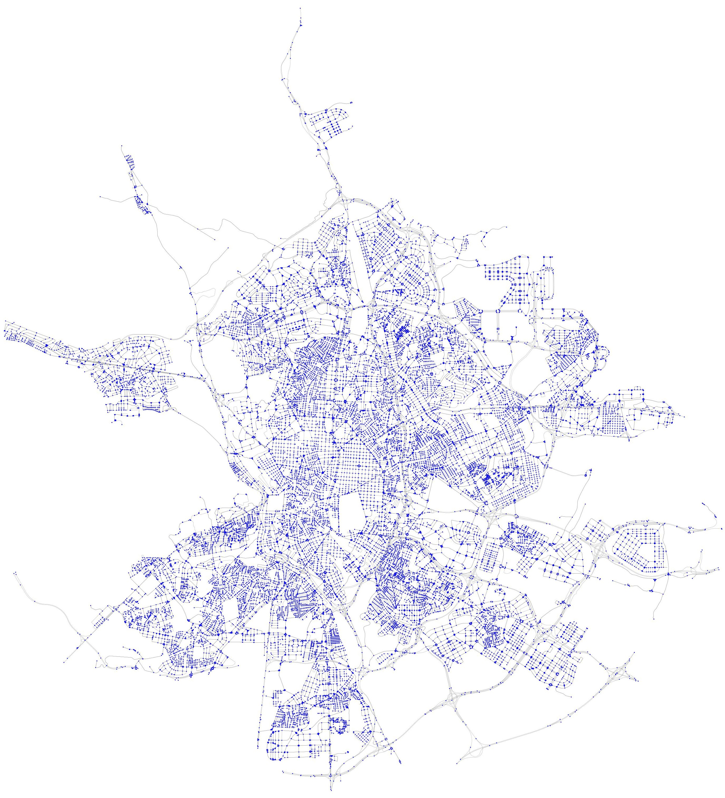
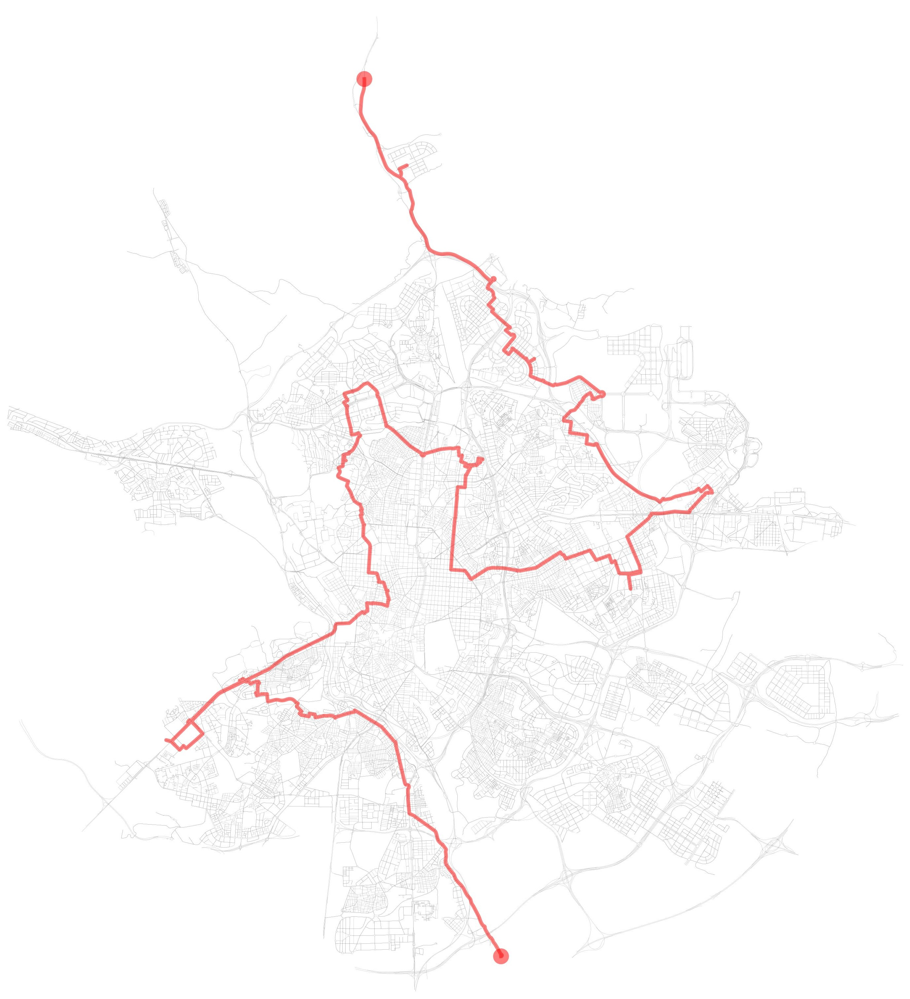

\newpage

## Introducción

El objetivo de este proyecto es implementar y comparar algoritmos de
camino más corto en grafos ponderados. Se abordarán los algoritmos de
Dijkstra, Bellman-Ford, Floyd-Warshall y Jhonson así como algunas
variantes. Se utilizarán librerías especializadas en grafos, operaciones
matemáticas y visualización de gráficos. Finalmente se elegirá uno de
los algoritmos y se implementará en la creación de un sistema de rutas
para la empresa de transporte YoTeLoLlevo S.L.

## Análisis de Riesgo

Al realizar este trabajo sobre algoritmos de camino más corto, podría
encontrarme con varios problemas que dificulten el desarrollo del
proyecto:

1.  **Incompatibilidad de Librerías**: Podría suceder que las versiones
    de las librerías utilizadas (especialmente `networkx` y `scipy`)
    tengan incompatibles, lo que generaría errores difíciles de depurar
    ya que depende mucho de la versión.

2.  **Complejidad Computacional**: Al trabajar con grafos grandes, los
    algoritmos de camino más corto pueden volverse extremadamente lentos
    y consumir una gran cantidad de memoria. Debería optimizar mi código
    y considerar el uso de estructuras de datos eficientes para manejar
    grafos de gran tamaño, aun así existe el riesgo de que mi pc se
    congele o que la sesión aborte.

3.  **LaTex**: Para convertir un notebook en PDF es necesario utilizar
    un compilador de latex. Lo cual es propenso a dar errores,
    especialmente si contiene gráficos o simbolos. Un solo error y el
    documento no se compilará.

## Justificación Técnica de Herramientas y Lenguajes

En este proyecto se han utilizado diversas herramientas y lenguajes de
programación para abordar el problema de encontrar caminos más cortos en
grafos. A continuación, se presenta una justificación técnica de las
herramientas y lenguajes empleados:

1.  **Python**:

    -   **Bibliotecas Especializadas**: Python cuenta con una amplia
        gama de bibliotecas especializadas para el análisis y
        manipulación de grafos, como `networkx`, `numpy`, `scipy`, y
        `matplotlib`, que simplifican el desarrollo y la visualización
        de soluciones.

2.  **NetworkX**:

    -   **Manipulación de Grafos**: es una biblioteca diseñada para la
        creación, manipulación y estudio de la estructura, dinámica y
        funciones de grafos complejos. Permite una fácil implementación
        y análisis de grafos.

    -   **Algoritmos Integrados**: Proporciona una variedad de
        algoritmos integrados para el análisis de grafos, incluyendo
        algoritmos de caminos más cortos, lo que facilita la
        implementación y comparación de diferentes métodos.

3.  **NumPy**:

    -   **Eficiencia Computacional**: `numpy` es una biblioteca
        fundamental para la computación científica en Python.
        Proporciona soporte para arrays y matrices multidimensionales,
        junto con una colección de funciones matemáticas de alto nivel
        para operar con estos arrays. Se ejecuta en `C` lo cual
        disminuye considerablemente los tiempos de ejecución.

    -   **Manejo de Datos**: Facilita el manejo y la manipulación
        eficiente de grandes conjuntos de datos, lo cual es crucial para
        el análisis de grafos y la implementación de algoritmos de
        caminos más cortos.

4.  **SciPy**:

    -   **Algoritmos Avanzados**: es una biblioteca utilizada para la
        computación científica y técnica. Incluye módulos para la
        optimización, álgebra lineal, integración, interpolación,
        funciones especiales, y más.

    -   **Algoritmos de Grafos**: al igual que NetworkX proporciona
        implementaciones eficientes de algoritmos de caminos más cortos,
        como Dijkstra, Bellman-Ford, Johnson y Floyd-Warshall, lo que
        permite comparar el rendimiento y la eficiencia de diferentes
        métodos.

5.  **Matplotlib**:

    -   **Visualización de Grafos**: `matplotlib` es una biblioteca de
        Python utilizada para crear visualizaciones estáticas, animadas
        e interactivas. Se ha utilizado para visualizar los grafos y sus
        propiedades de manera clara y comprensible.

    -   **Flexibilidad y Personalización**: Permite una gran
        flexibilidad y personalización en la creación de gráficos, lo
        que facilita la representación visual de los resultados del
        análisis de grafos.

6.  **Scribbr Citation Generator**:

    -   **Generación de Citas y Referencias**: Es una herramienta en
        línea que facilita la creación de citas y referencias, en este
        caso Harvard.

7.  **RStudio**:

    -   **Documentación y Reproducibilidad**: Facilita la documentación
        del flujo de trabajo y ofrece un entorno de desarrollo el cual
        incluye una consola, editor de sintaxis que apoya la ejecución
        de código, así como herramientas para el trazado, la depuración
        y la gestión del espacio de trabajo.

    -   **Exportación**: Permite la creación de documentos `HTML`,
        `PDF`, `Word` y `presentaciones` a partir de un archivo `Rmd`,
        lo cual es útil para la generación de informes y presentaciones.

8.  **LaTeX**:

    -   **Calidad Tipográfica**: LaTeX es un sistema de composición de
        textos de alta calidad que facilita la creación de documentos
        técnicos y científicos con una presentación profesional.

    -   **Soporte para Fórmulas Matemáticas**: Proporciona un soporte
        avanzado para la escritura de fórmulas matemáticas y expresiones
        complejas, lo cual es esencial para la presentación de
        algoritmos y conceptos matemáticos.

9.  **GitHub**:

    -   **Control de Versiones**: GitHub es una plataforma de desarrollo
        colaborativo que permite el control de versiones de proyectos de
        software. Facilita la colaboración, el seguimiento de cambios y
        la gestión de problemas.

10. **Timeit**:

    -   **Medición de Tiempo**: `timeit` es un módulo de Python que
        permite medir el tiempo de ejecución de pequeños fragmentos de
        código. Es útil para comparar el rendimiento de diferentes
        algoritmos y optimizar el código.

11. **OSMnx**:

    -   **Datos de OpenStreetMap**: OSMnx es una biblioteca de Python
        que permite descargar, modelar, analizar y visualizar datos de
        OpenStreetMap. Proporciona una forma sencilla de trabajar con
        datos geoespaciales y crear gráficos de redes de carreteras.

## Tipos de datos básicos empleados en el proyecto

1.  **diccionario**: Representa un mapa de adyacencia entre los nodos
    del grafo.

    -   Ejemplo: grafo = {'A': ['B', 'C'], 'B': ['A', 'D'], 'C': ['A',
        'F'], 'D': ['B'], 'E': ['F'], 'F': ['C', 'E']}

2.  **set:** Representa un conjunto de nodos o vértices del grafo.

    -   Ejemplo: vertices = {'A', 'B', 'C'}

3.  **tupla:** Similar a la lista, pero inmutable.

    -   Ejemplo: vertices = ('A', 'B', 'C')

4.  **matriz** Representa un conjunto de datos ordenados en filas y
    columnas.

    -   Ejemplo: [[2, 1, 0], [1, 0, 8], [5, 1, 2]]

5.  **numpy.ndarray**: Representa una matriz de adyacencia entre los
    nodos del grafo. Tienen la misma función que los arrays normales
    pero son más veloces y facilitan los calculos con diversas
    funciones.

    -   Ejemplo: grafo = np.array([[0, 1, 0], [1, 0, 1], [0, 1, 0]])

6.  **scipy.sparse.csr_matrix:** Representa una matriz dispersa en
    formato CSR (Compressed Sparse Row), que es eficiente para
    operaciones aritméticas y de almacenamiento.\\*Nota: el formato
    CSC(Compressed Sparse Column) da resultados muy similares.*

    -   Ejemplo: matriz_adyacencia = csr_matrix([[0, 1, 0], [1, 0, 1],
        [0, 1, 0]])

7.  **int:** Representa un número entero.

    -   Ejemplo: num_nodos = 14

8.  **float:** Representa un número decimal.

    -   Ejemplo: distancia = 7.65

9.  **Graphml** Representa un formato de archivo que permite guardar
    grafos en un formato de archivo XML.

### Creación de una Matriz de adyacencia y representación gráfica del grafo

Se utlizará para medir el tiempo de ejecución de distintos algoritmos

```{python}
# Importar librerias
import numpy as np
import networkx as nx
import matplotlib.pyplot as plt
import random
import scipy.sparse as sp
from scipy.sparse import csr_matrix
import osmnx as ox
import sys
import timeit

# Semilla para reproducibilidad
np.random.seed(2706)

# Crear una grafo con 20 nodos
G = nx.Graph()

for i in range(13):
    G.add_node(i)

# Añade aristas a la gráfica
G.add_edge(0, 3)
G.add_edge(13, 6)
G.add_edge(6, 9)
G.add_edge(9, 10)
G.add_edge(0, 2)
G.add_edge(2, 5)
G.add_edge(5, 8)
G.add_edge(8, 1)
G.add_edge(0, 1)
G.add_edge(1, 4)
G.add_edge(4, 7)
G.add_edge(7, 10)
G.add_edge(3, 6)
G.add_edge(6, 9)
G.add_edge(13, 10)
G.add_edge(12, 9)
G.add_edge(11, 10)
G.add_edge(13, 11)
G.add_edge(11, 7)
G.add_edge(7, 4)
G.add_edge(4, 9)
G.add_edge(1, 2)
G.add_edge(12, 5)
G.add_edge(5, 8)
G.add_edge(8, 11)
G.add_edge(11, 12)
G.add_edge(12, 10)
G.add_edge(4, 10)
G.add_edge(2, 12)

# Asigna un peso aleatorio a cada arista
for u, v in G.edges:
    G.edges[u, v]['weight'] = np.random.randint(1, 6)

# Calcula la matriz de adyacencia en forma de matriz dispersa
matriz_adyacencia = csr_matrix(nx.to_numpy_array(G))

# Dibujar el grafo con nodos en forma de elipse
fig = plt.figure(figsize=(8, 6))

# Número de nodos
num_nodos = len(G.nodes)

# Calcular las posiciones en forma de elipse
pos = {}
for i in range(num_nodos):
    angle = 2 * np.pi * i / num_nodos
    x = np.cos(angle)  
    y = np.sin(angle)
    pos[i] = (x, y)
    
# Dibujar nodos y aristas
nx.draw(G, pos, with_labels=True, node_color='lightblue', 
edge_color='darkgrey', node_size=1500, font_size=20)

plt.show()
```

### Creación de una función para desglosar el camino

```{python}
# Función para trazar el camino desde un nodo dado 
# hasta el nodo de inicio utilizando el array de predecesores
def trazar_camino(predecesores, nodo_inicio, nodo_fin):
    camino = []
    nodo_actual = nodo_fin
    while nodo_actual != nodo_inicio:
        camino.insert(0, nodo_actual)
        nodo_actual = predecesores[nodo_actual]
    camino.insert(0, nodo_inicio)
    camino = np.array(camino, dtype=int)
    return camino
```

## Algoritmos de ruta más corta

### Dijkstra con Montículos de Fibonacci

Para esta variante del algoritmo primero se explicará:

1.  La estructura de datos de `Montículos de Fibonacci`

2.  El algoritmo base de `Dijkstra`

3.  La implementación de `Dijkstra con Montículos de Fibonacci`

#### Montículos de Fibonacci

**Características**

1.  **Árbol binario**: Cada nodo tiene como máximo dos hijos (izquierdo
    y derecho).

2.  **Completo**: Es un árbol binario completo, lo que significa que
    todos sus niveles están completamente llenos, excepto el último
    nivel, que está lleno desde la izquierda a la derecha.

3.  **Raíz**: El nodo raíz es el elemento más grande del montículo.

4.  **Propiedad de Fibonacci**: Para cualquier nodo, la cantidad de
    nodos en su subárbol izquierdo es igual a la cantidad de nodos en su
    subárbol derecho, o uno menos.

5.  **Organización de los pesos**: El peso más pequeños se pone a la
    izquierda y el mayor a la derecha.

    -   **Ejemplo**:

| Peso 1 | Peso 2 | Peso que va a la izquierda |
|:------:|:------:|:--------------------------:|
|   2    |   5    |             2              |
|   1    |   -4   |             -4             |
|   -7   |   -2   |             -7             |

6.  **Implementación de una Cola de Prioridad**: Para permitir la
    eliminación rápida y la concatenación, se utilizan listas ligadas
    circularmente doblemente ligadas para conectar las raíces de todos
    los árboles. Los hijos de cada nodo también están conectados
    mediante tal lista. Para cada nodo, mantenemos su número de hijos y
    si el nodo está marcado.


Fuente:
[Growingwiththeweb](https://www.growingwiththeweb.com/data-structures/fibonacci-heap/overview/)

**Operaciones**

1.  **Encontrar Mínimo**

    Mantenemos un puntero a la raíz que contiene la clave mínima, lo que
    permite acceso en tiempo $O(1)$ a la mínima. Este puntero debe ser
    actualizado durante las otras operaciones, lo que añade solo un
    overhead constante de tiempo.

2.  **Unión**

    La operación de fusión simplemente concatena las listas de raíces de
    dos montículos juntos, y establece el mínimo en ser el menor de los
    dos montículos. Esto se puede hacer en tiempo $O(1)$, y la
    potencialidad no cambia, lo que lleva nuevamente a un tiempo
    amortizado constante.

3.  **Insertar**

    La operación de inserción se puede considerar como un caso especial
    de la operación de fusión, con un solo nodo. El nodo simplemente se
    agrega al final de la lista de raíces, aumentando la potencialidad
    en uno. El costo amortizado sigue siendo constante.

4.  **Eliminar Mínimo**

    Esta operación realiza la mayor parte del trabajo en restaurar la
    estructura de la pila. Tiene tres fases:

    **Fase 1:** Eliminar el nodo raíz con el elemento mínimo

    -   Se elimina el nodo raíz que contiene el elemento mínimo.
    -   Cada uno de sus hijos se convierte en un nuevo nodo raíz.
    -   El tiempo necesario para procesar estos nuevos nodos es $O(d)$,
        donde $d$ es el número de hijos del nodo eliminado. La
        potencialidad aumenta en $d-1$. Por lo tanto, el tiempo
        amortizado de esta fase es $O(d) = O(\log n)$.

    **Fase 2:** Enlazar nodos con la misma grado

    -   Hay hasta $n$ nodos raíz.
    -   Se reduce el número de nodos raíz enlazando juntos nodos del
        mismo grado.
    -   Cuando se encuentran dos nodos con el mismo grado, se hace que
        el nodo con la clave más grande sea hijo del otro, para mantener
        la propiedad de pila mínima. El grado del nodo más pequeño
        aumenta en uno.
    -   Esto se repite hasta que cada nodo tenga un grado diferente.

    **Fase 3**: Buscar el mínimo y actualizar el puntero

    -   Se busca la lista final de nodos raíz para encontrar el mínimo,
        y se actualiza el puntero correspondiente. Este paso toma tiempo
        $O(\log n)$ porque el número de nodos ha sido reducido.

    **Tiempo amortizado total**

    -   El tiempo amortizado total de esta operación es $O(\log n)$,
        siempre que $d = O(\log n)$. La prueba de esto se da en la
        siguiente sección.

5.  **Disminución de Clave**

    Si la disminución de la clave de un nodo $x$ hace que sea menor que
    su padre, entonces se corta de su padre y se convierte en una nueva
    raíz no marcada. Si también es menor que la clave mínima, entonces
    el puntero mínimo se actualiza. Luego iniciamos una serie de cortes
    cascados, comenzando con el padre de $x$. Mientras que el nodo
    actual esté marcado, se corta de su padre y se convierte en una raíz
    no marcada. Su padre original es considerado a continuación. Este
    proceso termina cuando se alcanza un nodo no marcado $y$. Si $y$ no
    es una raíz, se marca. En este proceso introducimos algún número de
    árboles nuevos, digamos $k$. Excepto posiblemente $x$, cada uno de
    estos nuevos árboles pierde su marca original. El nodo terminal $y$
    puede volverse marcado. Por lo tanto, el cambio en el número de
    nodos marcados es entre $-k$ y $-k+2$. La variación resultante en la
    potencialidad es $k + 2(-k+2) = -k+4$. El tiempo real necesario para
    realizar los cortes fue $O(k)$. Por lo tanto, el tiempo amortizado
    es $O(k) + c(-k+4)$, que es constante, siempre y cuando $c$ sea
    suficientemente grande.

**Desempeño**\
Aunque las pilas de Fibonacci parecen muy eficientes, tienen los
siguientes dos inconvenientes:

1.  **Complejidad en la implementación**: Son complicadas de
    implementar.

2.  **Ineficiencia en la práctica**: No son tan eficientes en la
    práctica cuando se comparan con formas teóricamente menos eficientes
    de pilas.

En su versión más simple, requieren manipulación de cuatro punteros por
nodo, mientras que solo dos o tres punteros por nodo son necesarios en
otras estructuras, como la pila binomial o la pila de pareja. Esto
resulta en un consumo de memoria grande por nodo y factores constantes
altos en todas las operaciones.

**Conclusión**

Los montículos de Fibonacci son estructuras de datos complejas que
ofrecen un desempeño eficiente en términos de tiempo para operaciones
como la eliminación del mínimo, la disminución de clave y la fusión.
Aunque tienen una implementación complicada y pueden ser ineficientes en
la práctica debido a su alto consumo de memoria por nodo, son útiles en
aplicaciones donde se requiere un acceso rápido al elemento mínimo.

#### Dijkstra

**Características**

1.  **Aplicabilidad**: Funciona en grafos dirigidos y no dirigidos.
2.  **Pesos Positivos**: Solo funciona con grafos que tienen pesos no
    negativos en las aristas.
3.  **Complejidad Temporal**: $O(V^2)$, donde $V$ es el número de
    vértices en el grafo.

**Pasos**

1.  **Inicialización**:

    -   Establece la distancia al nodo origen como 0 y a todos los demás
        nodos como infinito.
    -   Marca todos los nodos como no visitados. Establece el nodo
        origen como el nodo actual.

2.  **Selección del Nodo Actual**:

    -   Selecciona el nodo no visitado con la distancia más pequeña como
        el nodo actual. {width="380"}\
        Fuente:
        [Datacamp](https://www.datacamp.com/tutorial/dijkstra-algorithm-in-python)

3.  **Actualización de Distancias**:

    -   Para el nodo actual, considera todos sus vecinos no visitados y
        calcula sus distancias tentativas.
    -   Compara la distancia recién calculada con la distancia actual
        asignada y asigna el menor valor. {width="380"}\
        Fuente:
        [Datacamp](https://www.datacamp.com/tutorial/dijkstra-algorithm-in-python)\

4.  **Marcar Nodo como Visitado**:

    -   Una vez considerados todos los vecinos del nodo actual, marca el
        nodo actual como visitado. Un nodo visitado no será revisado
        nuevamente.\
        {width="380"}\
        Fuente:
        [Datacamp](https://www.datacamp.com/tutorial/dijkstra-algorithm-in-python)\

5.  **Repetición**:

    -   Si el nodo destino ha sido marcado como visitado o si la
        distancia más pequeña entre los nodos no visitados es infinita,
        el algoritmo termina.
    -   De lo contrario, selecciona el nodo no visitado con la distancia
        más pequeña, establece este nodo como el nuevo nodo actual y
        repite el proceso.\

**Ejemplo** \linebreak

Encontrar la ruta más corta entre nodos A y C

|       |    A     |    B     |    C     |    D     |    E     |
|:-----:|:--------:|:--------:|:--------:|:--------:|:--------:|
| **A** |    0     |    2     | $\infty$ | $\infty$ |    5     |
| **B** |    2     |    0     | $\infty$ |    3     | $\infty$ |
| **C** | $\infty$ | $\infty$ |    0     |    2     |    4     |
| **D** | $\infty$ |    3     |    2     |    0     | $\infty$ |
| **E** |    5     | $\infty$ |    4     | $\infty$ |    0     |

**Paso 1: Inicialización**

-   Creamos un conjunto de nodos visitados vacío, llamado V.
-   Creamos una tabla de distancias desde el nodo A, donde la distancia
    del nodo A a sí mismo es 0 y todas las demás distancias son
    infinitas.
-   Creamos una tabla de nodos previos, que contendrá la ruta más corta
    desde el nodo A hasta cada nodo.

| Nodo | Distancia |
|------|-----------|
| A    | 0         |
| B    | $\infty$  |
| C    | $\infty$  |
| D    | $\infty$  |
| E    | $\infty$  |

**Paso 2: Selección del nodo con la distancia más pequeña**

-   El nodo con la distancia más pequeña desde el nodo A es el nodo B,
    con una distancia de 2.
-   Agregamos el nodo B al conjunto de nodos visitados (V = {B}).

**Paso 3: Actualización de distancias**

-   La distancia del nodo C desde el nodo A no se puede calcular
    directamente a partir de las distancias conocidas.
-   La distancia del nodo D desde el nodo A es la suma de la distancia
    del nodo B a sí mismo y la distancia del nodo B al nodo D, que es
    2 + 3 = 5.
-   La distancia del nodo E desde el nodo A es 5 ya que hay arista
    directa

| Nodo | Distancia |
|------|-----------|
| A    | 0         |
| B    | 2         |
| C    | $\infty$  |
| D    | 5         |
| E    | 5         |

**Paso 4: Selección del nodo con la distancia más pequeña**

-   El nodo con la distancia más pequeña desde el nodo A es el nodo B,
    con una distancia de 2.
-   Agregamos el nodo B al conjunto de nodos visitados (V = {B}).

**Paso 5: Actualización de distancias**

-   La distancia del nodo C desde el nodo A es la suma de la distancia
    del nodo D a sí mismo y la distancia del nodo D al nodo C, que es
    $\infty$ + 2 = 2.
-   La distancia del nodo E desde el nodo A sigue siendo 5.

| Nodo | Distancia |
|------|-----------|
| A    | 0         |
| B    | 2         |
| C    | 2         |
| D    | 5         |
| E    | 5         |

**Paso 6: Selección del nodo con la distancia más pequeña**

-   El nodo con la distancia más pequeña desde el nodo A ahora es el
    nodo C, con una distancia de 2.
-   Agregamos el nodo C al conjunto de nodos visitados (V = {B, C}).

La ruta más corta del Nodo A al C utilizando el Algoritmo Dijkstra es:

1.  A → B
2.  B → D
3.  D → C

La distancia total es 2 + 3 + 2 = 7.

**Pseudocódigo**\
**Entrada:**

-   `G`: Grafo dirigido ponderado, donde cada arista tiene un peso
    (coste) asociado.
-   `s`: Nodo inicial.

**Salida:**

-   `distancias`: Arreglo que almacena la distancia mínima desde el nodo
    `s` a cada uno de los demás nodos en el grafo.

-   `predecesores`: Arreglo que almacena el predecesor de cada nodo en
    el camino más corto desde el nodo `s`.

**Inicialización**

-   `distancias[s] = 0` (la distancia desde el nodo `s` a sí mismo es
    0).
-   Para cada nodo `u` en los nodos, excepto `s`:
    -   `distancias[u] =`$\infty$ (la distancia desde el nodo `s` al
        nodo `u` no se conoce aún).
    -   `predecesores[u] = null` (no hay predecesor conocido para el
        nodo `u` en el camino más corto desde el nodo `s`).

**Bucle**

-   Mientras haya nodos que no han sido visitados:
    -   Selecciona el nodo `u` con la distancia mínima desde el nodo `s`
        (es decir, `distancias[u]` es la menor entre todas las
        distancias conocidas hasta ahora).
    -   Para cada arista `(u, v)` en el grafo que sale del nodo `u`:
        -   Calcula la distancia `d` desde el nodo `s` al nodo `v` a
            través del nodo `u`:
            `d = distancias[u] + peso(arista (u, v))`.

        -   Si esta distancia `d` es menor que la distancia conocida
            hasta ahora para el nodo `v`, actualiza:

            -   `distancias[v] = d`
            -   `predecesores[v] = u` (actualiza el predecesor del nodo
                `v` en el camino más corto desde el nodo `s`).\
                **Implementación en Python**\

            ```{python}
            inicio = timeit.default_timer()

            for i in range(10000):
              camino = nx.shortest_path(G, source=0, 
              weight='weight', method='dijkstra')
              
              distancia = nx.shortest_path_length(G, source=0, 
              weight='weight', method='dijkstra')

            print("Camino más corto: ", camino[13])

            print("Distancia: ", distancia[13])

            fin = timeit.default_timer()
            tiempo = fin - inicio
            print("Tiempo de ejecución: ", tiempo)
            ```

#### Implementación de Dijkstra en Montículos de Fibonacci

\
El algoritmo de Dijkstra es un método eficiente. Sin embargo, cuando se
trata con grandes conjuntos de datos, la complejidad del algoritmo puede
aumentar significativamente debido a la necesidad de mantener una cola
de prioridades ordenada. Una forma de mejorar la eficiencia de la cola
es implementar en ella los montículos de Fibonacci.

**Ventajas**

La implementación de montículos de Fibonacci en el algoritmo de Dijkstra
ofrece varias ventajas:

-   **Menor complejidad temporal**: $O(V^2)$ → $O(V \log V + E)$.

    -   $V$ es el número de vértices en el grafo.

    -   $E$ es el número de aristas en el grafo.

-   **Reduce la memoria**: Utiliza menos memoria que una cola estándar,
    ya que solo se necesitan mantener los nodos en el montículo.

\newpage

**Diagrama de Flujo**\
{style="margin :auto;"
width="587"}\
**Pseudocódigo**\
**Entradas:**

-   `grafo`: el grafo que se desea buscar
-   `origen`: el nodo de origen

**Salidas:**

-   `distancias`: un arreglo que almacena las distancias mínimas desde
    el nodo de origen hasta cada uno de los nodos del grafo

-   `predecesores`: un arreglo que almacena los predecesores de cada uno
    de los nodos del grafo

**Inicio**

1.  **Iniciar variables**: crear un objeto vacío para almacenar las
    distancias (`distancias`) y los predecesores (`predecesores`)

2.  **Insertar el nodo origen en el montículo de Fibonacci**:

    -   Llamar a la función `insertar_en_montículo(origen, raíz)` para
        insertar el nodo origen en el montículo de Fibonacci
        (complejidad temporal $O(\log V)$)

3.  **Iterar hasta que se encuentre el destino o se vacíe el
    montículo**:

    -   Mientras el montículo no esté vacío y el nodo actual no sea el
        destino:
        -   Extraer el nodo con la distancia mínima del montículo
            (`nodo_minimo`)
        -   Si el nodo extraído es el destino, terminar la búsqueda

4.  **Actualizar las distancias y predecesores**:

    -   Para cada vecino `vecino` de `nodo_minimo` que no haya sido
        visitado antes:
        -   Calcular la distancia desde el origen hasta `vecino` a
            través de `nodo_minimo`
        -   Si esta distancia es menor que la distancia actual almacena
            en `distancias[vecino]`, actualizar `distancias[vecino]` y
            `predecesores[vecino]`

5.  **Insertar los vecinos no visitados en el montículo de Fibonacci**:

    -   Para cada vecino `vecino` de `nodo_minimo` que no haya sido
        visitado antes:

        -   Llamar a la función `insertar_en_montículo(vecino, raíz)`
            para insertar el vecino en el montículo de Fibonacci
            (complejidad temporal $O(\log V)$)

6.  **Iterar sobre las aristas del grafo**:

    -   Para cada arista `(u, v)` en el grafo:
        -   Si `distancias[u] + peso(u, v)` es menor que la distancia
            actual almacena en `distancias[v]`, actualizar
            `distancias[v]` y `predecesores[v]`

7.  **Devolver**: devolver las distancias (`distancias`) y los
    predecesores (`predecesores`)

**Complejidad temporal**

Es $O(V \log V + E)$ porque se repite el proceso de extraer el nodo con
la distancia más pequeña del montículo de Fibonacci un número igual al
número de nodos en el grafo ($V$), lo que tiene una complejidad temporal
de $O(\log V)$, y se actualizan las distancias y predecesores de los
nodos incidentes a cada arista, lo que tiene una complejidad temporal de
$O(E)$.

**Implementación en Python**\

```{python}
from scipy.sparse.csgraph import dijkstra

inicio = timeit.default_timer()

for i in range(10000):
  # Utiliza el algoritmo de Dijkstra a través de scipy
  dist_matrix, predecessors = dijkstra(matriz_adyacencia, directed=False,
  indices = 0, return_predecessors=True)

# Ruta del nodo 0 al 13
camino = trazar_camino(predecessors, 0, 13)

print("El camino desde el nodo 0 hasta el nodo 13 es:", camino)
print("La distancia mínima entre el nodo 0 y el nodo 13 es:", dist_matrix[13])

fin = timeit.default_timer()
tiempo_ejecución = round(fin - inicio, 4)
print("Tiempo de ejecución: ", tiempo_ejecución, " segundos")
```

### Bellman Ford

#### Características

1.  **Aplicabilidad**: El algoritmo Bellman-Ford se aplica a grafos
    dirigidos con pesos negativos, ya que no puede manejar aristas con
    pesos negativos en grafos no dirigidos.
2.  **Pesos Negativos**: Puede manejar grafos con pesos negativos en las
    aristas.
3.  **Complejidad Temporal**: Tiene una complejidad temporal de $O(VE)$
4.  **Detección de Ciclos Negativos**: Puede detectar la presencia
    potencial de ciclos de peso negativo en el grafo.
5.  **Distancias Mínimas**: Calcula las distancias mínimas desde un nodo
    origen a todos los demás nodos, siempre y cuando no haya ciclos de
    peso negativo.

#### Pasos

\
**1: Inicialización**

-   Se selecciona un nodo origen en el grafo.
-   Se establece la distancia al nodo origen como $0$, y se establecen
    las distancias a todos los demás nodos como infinito (representado
    por un valor muy grande).

**2: Relajación de aristas**

-   El algoritmo repite el siguiente proceso $V-1$ veces, donde $V$ es
    el número de vértices en el grafo.
-   Para cada vértice $v$:
    -   Se revisan todas las aristas incidentes en $v$, es decir,
        aquellas que comienzan o terminan en $v$.
    -   Para cada arista $(u,v)$ con peso $w$:
        -   Si la distancia actual a $u$ más el peso de la arista $w$ es
            menor que la distancia actual a $v$, se actualiza la
            distancia a $v$.

**3: Detección de ciclos negativos**

-   Después de $V-1$ iteraciones de relaxación de aristas, se revisan
    todas las aristas una vez más.
-   Para cada arista $(u,v)$ con peso $w$:
    -   Si la distancia actual a u más el peso de la arista w es menor
        que la distancia actual a $v$, significa que hay un ciclo
        negativo en el grafo.
    -   En este caso, el algoritmo indica la presencia de un ciclo
        negativo y no puede garantizar la corrección de las distancias
        mínimas.

**4: Resultado**

-   Si no se detecta ningún ciclo negativo después de $V-1$ iteraciones
    de relaxación de aristas más una última revisión, el algoritmo ha
    encontrado las distancias mínimas desde el nodo origen a todos los
    demás nodos en el grafo.
-   Las distancias mínimas están almacenadas en la matriz de distancias,
    que es una tabla que contiene la distancia mínima desde el nodo
    origen a cada vértice en el grafo.

**Ejemplo**\

Supongamos que tenemos el siguiente grafo con 5 nodos:

|       |    A     |    B     |    C     |    D     |    E     |
|:-----:|:--------:|:--------:|:--------:|:--------:|:--------:|
| **A** |    0     |    6     | $\infty$ |    7     | $\infty$ |
| **B** | $\infty$ |    0     |    5     |    8     |    -4    |
| **C** | $\infty$ |    -2    |    0     | $\infty$ | $\infty$ |
| **D** | $\infty$ | $\infty$ |    -3    |    0     |    9     |
| **E** |    2     | $\infty$ |    7     | $\infty$ |    0     |

1.  **Inicialización**:

    -   Establecer la distancia al nodo origen (A) como 0 y a todos los
        demás nodos como infinito.
    -   Inicializar la matriz de distancias y predecesores.

    | Nodo | Distancia | Predecesor |
    |------|-----------|------------|
    | A    | 0         | \-         |
    | B    | $\infty$  | \-         |
    | C    | $\infty$  | \-         |
    | D    | $\infty$  | \-         |
    | E    | $\infty$  | \-         |

2.  **Relajación de aristas**:

    -   Repetir el proceso de relajación para cada arista $V-1$ veces (4
        veces en este caso).

    **Iteración 1**:

    -   Relajar arista (A, B): dist[B] = min($\infty$, 0 + 6) = 6
    -   Relajar arista (A, D): dist[D] = min($\infty$, 0 + 7) = 7
    -   Relajar arista (B, C): dist[C] = min($\infty$, 6 + 5) = 11
    -   Relajar arista (B, E): dist[E] = min($\infty$, 6 - 4) = 2
    -   Relajar arista (C, B): dist[B] = min(6, 11 - 2) = 9
    -   Relajar arista (D, C): dist[C] = min(11, 7 - 3) = 4
    -   Relajar arista (E, A): dist[A] = min(0, 2 + 2) = 0

    | Nodo | Distancia | Predecesor |
    |------|-----------|------------|
    | A    | 0         | \-         |
    | B    | 6         | A          |
    | C    | 4         | D          |
    | D    | 7         | A          |
    | E    | 2         | B          |

    **Iteración 2**:

    -   Relajar arista (B, C): dist[C] = min(4, 6 + 5) = 4
    -   Relajar arista (B, E): dist[E] = min(2, 6 - 4) = 2
    -   Relajar arista (C, B): dist[B] = min(6, 4 - 2) = 2
    -   Relajar arista (D, C): dist[C] = min(4, 7 - 3) = 4
    -   Relajar arista (E, A): dist[A] = min(0, 2 + 2) = 0

    | Nodo | Distancia | Predecesor |
    |------|-----------|------------|
    | A    | 0         | \-         |
    | B    | 2         | C          |
    | C    | 4         | D          |
    | D    | 7         | A          |
    | E    | 2         | B          |

    **Iteración 3**:

    -   Relajar arista (B, C): dist[C] = min(4, 2 + 5) = 4
    -   Relajar arista (B, E): dist[E] = min(2, 2 - 4) = -2
    -   Relajar arista (C, B): dist[B] = min(2, 4 - 2) = 2
    -   Relajar arista (D, C): dist[C] = min(4, 7 - 3) = 4
    -   Relajar arista (E, A): dist[A] = min(0, -2 + 2) = 0

    | Nodo | Distancia | Predecesor |
    |------|-----------|------------|
    | A    | 0         | \-         |
    | B    | 2         | C          |
    | C    | 4         | D          |
    | D    | 7         | A          |
    | E    | -2        | B          |

    **Iteración 4**:

    -   Relajar arista (B, C): dist[C] = min(4, 2 + 5) = 4
    -   Relajar arista (B, E): dist[E] = min(-2, 2 - 4) = -2
    -   Relajar arista (C, B): dist[B] = min(2, 4 - 2) = 2
    -   Relajar arista (D, C): dist[C] = min(4, 7 - 3) = 4
    -   Relajar arista (E, A): dist[A] = min(0, -2 + 2) = 0

    | Nodo | Distancia | Predecesor |
    |------|-----------|------------|
    | A    | 0         | \-         |
    | B    | 2         | C          |
    | C    | 4         | D          |
    | D    | 7         | A          |
    | E    | -2        | B          |

3.  **Detección de ciclos negativos**:

    -   Revisar todas las aristas una vez más para detectar ciclos
        negativos. Si se puede relajar alguna arista, entonces hay un
        ciclo negativo.

4.  **Resultado**:

    -   La matriz de distancias mínimas desde el nodo origen (A) a todos
        los demás nodos es:

    | Nodo | Distancia | Predecesor |
    |------|-----------|------------|
    | A    | 0         | \-         |
    | B    | 2         | C          |
    | C    | 4         | D          |
    | D    | 7         | A          |
    | E    | -2        | B          |

#### Implementación en Python  

\

```{python}
from scipy.sparse.csgraph import bellman_ford

inicio = timeit.default_timer()
for i in range(10000):
  # Utiliza el algoritmo de Bellman-Ford a través de scipy
  dist_matrix, predecessors = bellman_ford(matriz_adyacencia, directed=False, 
  indices=0, return_predecessors=True)

# Ruta del nodo 0 al 13
camino = trazar_camino(predecessors, 0, 13)

print("El camino desde el nodo 0 hasta el nodo 13 es:", camino)
print("La distancia mínima entre el nodo 0 y el nodo 13 es:", dist_matrix[13])

fin = timeit.default_timer()
tiempo_ejecución = round(fin - inicio, 4)
print("Tiempo de ejecución: ", tiempo_ejecución, " segundos")
```

### Johnson

#### Características

1.  **Aplicabilidad**: El algoritmo de Johnson se aplica a grafos
    dirigidos **sin ciclos negativos**. Puede manejar grafos no
    dirigidos transformándolos en dirigidos duplicando las aristas.
2.  **Pesos Positivos y Negativos**: Puede manejar grafos con pesos
    positivos y negativos en las aristas, siempre y cuando no existan
    ciclos de peso negativo.
3.  **Complejidad Temporal**: $O(V^2 \log V + VE)$
4.  **Uso de Algoritmos Auxiliares**: Utiliza el algoritmo de
    Bellman-Ford para reponderar los pesos de las aristas y luego aplica
    el algoritmo de Dijkstra para encontrar las distancias más cortas
    desde cada vértice.

#### Pasos

1.  **Añadir nuevo nodo**: Primero se añade un nuevo nodo $q$ al grafo,
    conectado a cada uno de los nodos del grafo por una arista de peso
    cero.
2.  **Ejecutar Bellman-Ford**: En segundo lugar, se utiliza el algoritmo
    de Bellman-Ford, empezando por el nuevo vértice $q$, para determinar
    para cada vértice $v$ el peso mínimo $h(v)$ del camino de $q$ a $v$.
    Si en este paso se detecta un ciclo negativo, el algoritmo concluye.
3.  **Modificar pesos**: Seguidamente, a las aristas del grafo original
    se les cambia el peso usando los valores calculados por el algoritmo
    de Bellman-Ford: una arista de $u$ a $v$ con peso $w(u, v)$ se
    transforma a $w(u, v) + h(u) - h(v)$.
4.  **Ejecutar Dijkstra**: Por último, para cada nodo $s$ se usa el
    algoritmo de Dijkstra (posiblemente con montículos de Fibonacci)
    para determinar el camino más corto entre $s$ y los otros nodos,
    usando el grafo con pesos modificados.

 Fuente:
[Wikipedia](https://es.wikipedia.org/wiki/Algoritmo_de_Johnson)

**Ejemplo** \linebreak

Supongamos que tenemos el siguiente grafo con 4 nodos:

|       |  A  |    B     |    C     |    D     |
|:-----:|:---:|:--------:|:--------:|:--------:|
| **A** |  0  |    3     | $\infty$ |    7     |
| **B** |  8  |    0     |    2     | $\infty$ |
| **C** |  5  | $\infty$ |    0     |    1     |
| **D** |  2  | $\infty$ | $\infty$ |    0     |

1.  **Añadir nuevo nodo**:

    -   Añadir un nuevo nodo $q$ conectado a cada uno de los nodos del
        grafo por una arista de peso cero.

    |       |  A  |    B     |    C     |    D     |  q  |
    |:-----:|:---:|:--------:|:--------:|:--------:|:---:|
    | **A** |  0  |    3     | $\infty$ |    7     |  0  |
    | **B** |  8  |    0     |    2     | $\infty$ |  0  |
    | **C** |  5  | $\infty$ |    0     |    1     |  0  |
    | **D** |  2  | $\infty$ | $\infty$ |    0     |  0  |
    | **q** |  0  |    0     |    0     |    0     |  0  |

2.  **Ejecutar Bellman-Ford**:

    -   Ejecutar el algoritmo de Bellman-Ford desde el nodo $q$ para
        determinar los pesos mínimos $h(v)$ desde $q$ a cada nodo $v$.

    | Nodo | h(v) |
    |------|------|
    | A    | 0    |
    | B    | 0    |
    | C    | 0    |
    | D    | 0    |
    | q    | 0    |

3.  **Modificar pesos**:

    -   Modificar los pesos de las aristas usando los valores calculados
        por Bellman-Ford: $w'(u, v) = w(u, v) + h(u) - h(v)$.

    |       |  A  |    B     |    C     |    D     |
    |:-----:|:---:|:--------:|:--------:|:--------:|
    | **A** |  0  |    3     | $\infty$ |    7     |
    | **B** |  8  |    0     |    2     | $\infty$ |
    | **C** |  5  | $\infty$ |    0     |    1     |
    | **D** |  2  | $\infty$ | $\infty$ |    0     |

4.  **Ejecutar Dijkstra**:

    -   Ejecutar el algoritmo de Dijkstra desde cada nodo usando los
        pesos modificados.

    **Desde A**:

    -   Distancias: A: 0, B: 3, C: 5, D: 6

    **Desde B**:

    -   Distancias: A: 8, B: 0, C: 2, D: 3

    **Desde C**:

    -   Distancias: A: 5, B: 8, C: 0, D: 1

    **Desde D**:

    -   Distancias: A: 2, B: 5, C: 7, D: 0

5.  **Resultado**:

    -   La matriz de distancias mínimas entre todos los pares de nodos
        es:

    |       |  A  |  B  |  C  |  D  |
    |:-----:|:---:|:---:|:---:|:---:|
    | **A** |  0  |  3  |  5  |  6  |
    | **B** |  8  |  0  |  2  |  3  |
    | **C** |  5  |  8  |  0  |  1  |
    | **D** |  2  |  5  |  7  |  0  |

#### Implementación en Python  

\

```{python}
from scipy.sparse.csgraph import johnson

inicio = timeit.default_timer()
for i in range(10000):
  #Utiliza el algoritmo de Johnson a través de scipy
  dist_matrix, predecessors = johnson(matriz_adyacencia ,directed=False, 
  indices=0, return_predecessors=True)

# Ruta del nodo 0 al 13
camino = trazar_camino(predecessors, 0, 13)

print("El camino desde el nodo 0 hasta el nodo 13 es:", camino)
print("La distancia mínima entre el nodo 0 y el nodo 13 es:", dist_matrix[13])

fin = timeit.default_timer()
tiempo_ejecución = round(fin - inicio, 4)
print("Tiempo de ejecución: ", tiempo_ejecución, " segundos")
```

### Floyd-Warshall

#### Características

1.  **Aplicabilidad**: Se aplica a grafos dirigidos y no dirigidos.
2.  **Pesos Positivos y Negativos**: Puede manejar grafos con pesos
    positivos y negativos en las aristas, siempre y cuando no existan
    ciclos de peso negativo.
3.  **Complejidad Temporal**: $O(V^3)$, donde $V$ es el número de
    vértices.

#### Pasos

\
1. **Inicialización** - Crear una matriz de distancias `dist` donde
`dist[i][j]` es la distancia entre el nodo `i` y el nodo `j`.
Inicialmente, `dist[i][j]` es el peso de la arista entre `i` y `j` si
existe, de lo contrario es infinito. La distancia de un nodo a sí mismo
es 0. 2. **Iteración** - Para cada nodo `k`, actualizar la matriz de
distancias considerando `k` como un nodo intermedio. Para cada par de
nodos `(i, j)`, actualizar `dist[i][j]` como el mínimo entre
`dist[i][j]` y `dist[i][k] + dist[k][j]`. 3. **Resultado** - Después de
completar las iteraciones, la matriz `dist` contendrá las distancias
mínimas entre todos los pares de nodos. 4. **Detección de Ciclos
Negativos** - Si `dist[i][i] < 0` para cualquier nodo `i`, entonces el
grafo contiene un ciclo de peso negativo.

**Ejemplo** \linebreak

Supongamos que tenemos el siguiente grafo con 4 nodos:

|       |  A  |    B     |    C     |    D     |
|:-----:|:---:|:--------:|:--------:|:--------:|
| **A** |  0  |    3     | $\infty$ |    7     |
| **B** |  8  |    0     |    2     | $\infty$ |
| **C** |  5  | $\infty$ |    0     |    1     |
| **D** |  2  | $\infty$ | $\infty$ |    0     |

1.  **Inicialización**:

    -   Crear una matriz de distancias `dist` donde `dist[i][j]` es la
        distancia entre el nodo `i` y el nodo `j`. Inicialmente,
        `dist[i][j]` es el peso de la arista entre `i` y `j` si existe,
        de lo contrario es infinito. La distancia de un nodo a sí mismo
        es 0.

    |       |  A  |    B     |    C     |    D     |
    |:-----:|:---:|:--------:|:--------:|:--------:|
    | **A** |  0  |    3     | $\infty$ |    7     |
    | **B** |  8  |    0     |    2     | $\infty$ |
    | **C** |  5  | $\infty$ |    0     |    1     |
    | **D** |  2  | $\infty$ | $\infty$ |    0     |

2.  **Iteración**:

    -   Para cada nodo `k`, actualizar la matriz de distancias
        considerando `k` como un nodo intermedio. Para cada par de nodos
        `(i, j)`, actualizar `dist[i][j]` como el mínimo entre
        `dist[i][j]` y `dist[i][k] + dist[k][j]`.

    **Iteración con k = A (k = 0)**:

    -   No hay cambios ya que `dist[i][j]` no se puede mejorar usando el
        nodo A como intermedio.

    **Iteración con k = B (k = 1)**:

    -   Actualizar dist[A][C] como min($\infty$, 3 + 2) = 5
    -   Actualizar dist[A][D] como min(7, 3 + $\infty$) = 7
    -   Actualizar dist[B][D] como min($\infty$ 0 + $\infty$) = $\infty$
    -   Actualizar dist[C][B] como min($\infty$, $\infty$ + 0) =
        $\infty$
    -   Actualizar dist[D][B] como min($\infty$, $\infty$ + 8) =
        $\infty$

    |       |  A  |    B     |    C     |    D     |
    |:-----:|:---:|:--------:|:--------:|:--------:|
    | **A** |  0  |    3     |    5     |    7     |
    | **B** |  8  |    0     |    2     | $\infty$ |
    | **C** |  5  | $\infty$ |    0     |    1     |
    | **D** |  2  | $\infty$ | $\infty$ |    0     |

    **Iteración con k = C (k = 2)**:

    -   Actualizar dist[A][D] como min(7, 5 + 1) = 6
    -   Actualizar dist[B][D] como min($\infty$, 2 + 1) = 3
    -   Actualizar dist[C][A] como min(5, 0 + 5) = 5
    -   Actualizar dist[D][A] como min(2, $\infty$ + 2) = 2
    -   Actualizar dist[D][B] como min($\infty$, $\infty$ + 8) =
        $\infty$

    |       |  A  |    B     |    C     |  D  |
    |:-----:|:---:|:--------:|:--------:|:---:|
    | **A** |  0  |    3     |    5     |  6  |
    | **B** |  8  |    0     |    2     |  3  |
    | **C** |  5  | $\infty$ |    0     |  1  |
    | **D** |  2  | $\infty$ | $\infty$ |  0  |

    **Iteración con k = D (k = 3)**:

    -   Actualizar dist[A][B] como min(3, 6 + $\infty$) = 3
    -   Actualizar dist[A][C] como min(5, 6 + $\infty$) = 5
    -   Actualizar dist[B][A] como min(8, 3 + 2) = 5
    -   Actualizar dist[B][C] como min(2, 3 + $\infty$) = 2
    -   Actualizar dist[C][A] como min(5, 1 + 2) = 3
    -   Actualizar dist[C][B] como min($\infty$, 1 + $\infty$) =
        $\infty$
    -   Actualizar dist[D][A] como min(2, 0 + 2) = 2
    -   Actualizar dist[D][B] como min($\infty$, 0 + $\infty$) =
        $\infty$
    -   Actualizar dist[D][C] como min($\infty$, 0 + $\infty$) =
        $\infty$

    |       |  A  |  B  |  C  |  D  |
    |:-----:|:---:|:---:|:---:|:---:|
    | **A** |  0  |  3  |  5  |  6  |
    | **B** |  8  |  0  |  2  |  3  |
    | **C** |  5  |  8  |  0  |  1  |
    | **D** |  2  |  5  |  7  |  0  |

3.  **Resultado**:

    -   Después de completar las iteraciones, la matriz `dist` contendrá
        las distancias mínimas entre todos los pares de nodos.

4.  **Detección de Ciclos Negativos**:

    -   Si `dist[i][i] < 0` para cualquier nodo `i`, entonces el grafo
        contiene un ciclo de peso negativo.
        -   En este caso todas las distancias son positivas por lo que
            no hay ciclos negativos.


Fuente:
[Wikipedia](https://es.wikipedia.org/wiki/Algoritmo_de_Floyd-Warshall)

#### Implementación en Python  

\

```{python}
from scipy.sparse.csgraph import floyd_warshall

inicio = timeit.default_timer()

for i in range(10000):
  #Utiliza el algoritmo de Floyd-Warshall a través de scipy
  #Nota: Este algoritmo no permite calcular la distancia eligiendo un nodo de inicio
  
  dist_matrix, predecessors = floyd_warshall(matriz_adyacencia, unweighted=False, 
  directed=False, return_predecessors=True)

# Ruta del nodo 0 al 13
camino = trazar_camino(predecessors[0], 0, 13)

print("El camino desde el nodo 0 hasta el nodo 13 es:", camino)
print("La distancia mínima entre el nodo 0 y el nodo 13 es:", dist_matrix[0, 13])

fin = timeit.default_timer()
tiempo_ejecución = round(fin - inicio, 4)
print("Tiempo de ejecución: ", tiempo_ejecución, " segundos")
```

### Comparación de algoritmos

Como se ha podido observar cada algoritmo tiene sus ventajas y
desventajas. Dijkstra es el más eficiente para grafos con pesos
positivos. Bellman-Ford maneja pesos negativos y detecta ciclos
negativos, pero es más lento. Johnson combina Bellman-Ford y Dijkstra
para manejar pesos negativos sin ciclos negativos. Floyd-Warshall es
simple y maneja todos los pares de nodos, pero es el menos eficiente.

La elección del algoritmo depende del tipo de grafo, su tamaño,
capacidad computacional y requerimientos del problema a solventar.

## Elección final de Algoritmo de camino más corto

He elegido el algoritmo de `Dijkstra con Monticulos de Fibonacci`.

**Razones:**

1.  **Eficiencia**: El algoritmo de Dijkstra es muy eficiente para
    grafos con pesos positivos. Su complejidad temporal es
    $O(V \log V + E)$, lo que lo hace adecuado para grafos grandes.

2.  **Optimización**: Dijkstra está específicamente optimizado para
    encontrar la ruta más corta desde un solo origen a un solo destino,
    lo que se ajusta perfectamente al problema de encontrar la ruta más
    corta en un mapa.

3.  **Uso de Pesos Positivos**: Dado que el grafo representa un mapa
    solo tendrá pesos positivos, `Dijkstra` es ideal ya que está
    diseñado para manejar este tipo de grafos sin problemas.

## Creación del sistema de rutas

### Objetivo

Crear un sistema de rutas que permita encontrar la ruta más corta entre
varios destinos en un mapa. El sistema debe ser capaz de calcular la
distancia total de la ruta y mostrar la secuencia de nodos que componen
la ruta para poder realizar la entrega de paquetes de la manera más
eficiente.

#### Trazar camino entre dos nodos

##### Pseudocódigo

\

El procedimiento es el mismo que el agoritmo `trazar_camino` sin añadir
el nodo destino al final de la lista para evitar duplicidades.

Nombre de la función: `Trazar_camino_intermedio`.

-   **Entrada**:
    -   `predecesores`: array con los predecesores de cada nodo.
    -   `nodo_inicio`: int con el nodo de inicio.
    -   `nodo_fin`: int con el nodo destino.
-   **Salida**:
    -   `camino`: array con los nodos que componen la ruta.
-   **Proceso**:
    1.  Inicializar `camino` como una lista vacía.
    2.  Inicializar `nodo_actual` como `nodo_fin`.
    3.  Mientras `nodo_actual` no sea igual a `nodo_inicio`:
        1.  Añadir `nodo_actual` a `camino`.
        2.  Actualizar `nodo_actual` con el predecesor de `nodo_actual`.
    4.  Devolver `camino`.

##### Diagrama de flujo

\
{width="599"}

#### Trazar el camino más corto que contenga todos los nodos

\
El procedimiento para crear una ruta que visite varios destinos consiste
en encontrar y visitar el nodo más cercano al nodo actual con Dijkstra
hasta que se visiten todos los destinos.

##### Pseudocódigo

\
Nombre de la función: `Crear_ruta`.

-   **Entrada**:
    -   `M`: matriz de adyacencia del grafo.
    -   `inicio`: int con el nodo de inicio.
    -   `destinos`: array con los nodos destino.
-   **Salida**:
    -   `ruta`: array con los nodos que componen la ruta.
    -   `distancia`: int con la distancia total de la ruta.
-   **Proceso**:
    1.  Inicializar `ruta` como un array con el nodo de inicio.
    2.  Calcular la matriz de distancias y predecesores con Dijkstra.
    3.  Crear un diccionario con las distancias de cada nodo.
    4.  Eliminar los nodos con distancia 0 y los nodos que no estén en
        `destinos`.
    5.  Encontrar el nodo más cercano al nodo de inicio.
    6.  Añadir los nodos de la ruta más corta al array `ruta`.
    7.  Eliminar el nodo más cercano de `destinos`.
    8.  Mientras haya nodos en `destinos`:
        1.  Calcular la matriz de distancias y predecesores con
            Dijkstra.
        2.  Guardar el nodo anterior.
        3.  Crear un diccionario con las distancias de cada nodo.
        4.  Eliminar los nodos con distancia 0 y los nodos que no estén
            en `destinos`.
        5.  Encontrar el nodo más cercano al nodo anterior.
        6.  Añadir los nodos de la ruta más corta al array `ruta`.
        7.  Sumar la distancia al nodo más cercano a `distancia`.
    9.  Devolver `ruta` y `distancia`.

##### Diagrama de flujo

\
{width="600"}

### Implementación en Python

```{python}

# Función para trazar la ruta
def Trazar_camino_intermedio(predecesores, nodo_inicio, nodo_fin):
    camino = []                                 
    nodo_actual = nodo_fin                      
    
    while nodo_actual != nodo_inicio:           
        camino.insert(0, nodo_actual)              
        nodo_actual = predecesores[nodo_actual] 
    
    return camino                                          

# Fución para crea la ruta
def Crear_ruta(M, inicio, destinos):
  # Iniciar la ruta en el nodo inicial
  ruta = np.array([inicio])
  distancia = 0
  
  nodo_más_cercano = inicio
  destinos = np.array(destinos)
  
  # Mientras queden destinos por visitar
  while len(destinos) > 0:
    # Utilizar el algoritmo de Dijkstra para encontrar 
    # la ruta más corta a cada nodo destino
    dist_matrix, predecessors= dijkstra(M, directed=True, 
    indices=nodo_más_cercano, return_predecessors=True, limit=50000)
    
    nodo_anterior = nodo_más_cercano
    
    # Pasar la matriz de distancias a diccionario
    dist_dic = {index: value for index, value in enumerate(dist_matrix)}
  
    # Eliminar todos los valores que sean 0 y los nodos que no estén en destinos
    dist_dic = {key: value for key, value in dist_dic.items() 
    if value != 0 and key in destinos}
    
    # Encontrar el valor mínimo en el diccionario de distancias
    min_value = min(dist_dic.values())
    
    # Encontrar el siguiente nodo más cercano
    for key, value in dist_dic.items(): 
      if value == min_value: 
        nodo_más_cercano = key 
        break
    
    # Actualizar la lista de destinos eliminando el nodo más cercano encontrado
    destinos = destinos[destinos != nodo_más_cercano]
    
    # Añadir el camino intermedio a la ruta
    ruta = np.concatenate((ruta, 
    np.array(Trazar_camino_intermedio(predecessors, nodo_anterior, nodo_más_cercano))))
    
    # Sumar la distancia al nodo más cercano a la distancia total
    distancia += dist_dic[nodo_más_cercano]
  
  # Devolver la ruta completa y la distancia total
  return ruta, distancia

```

#### Análisis de la complejidad temporal

##### Trazar_camino_intermedio

\
1. **Inicialización de la lista de camino y del nodo actual**: $O(1)$.
2. **Bucle principal**: - El bucle se ejecuta hasta que el nodo actual
sea igual al nodo de inicio, lo que puede ser $O(n)$ en el peor caso. -
Dentro del bucle, se realizan las mismas operaciones en cada iteración,
cada una con su propia complejidad.

La complejidad temporal total de la función es:\
$O(1) + O(n) * [O(1) + O(1)] + O(n)$

Simplificando, se obtiene:\
$O(n)$

##### Crear_ruta

\
1. **Inicialización de la ruta y cálculo de la matriz de distancias y
predecesores con Dijkstra**: - La inicialización de la ruta es $O(1)$. -
La llamada a Dijkstra tiene una complejidad de $O(V log V + E)$.

2.  **Creación del diccionario de distancias y eliminación de valores**:

    -   Crear el diccionario tiene una complejidad de $O(V)$.
    -   Eliminar valores del diccionario tiene una complejidad de
        $O(V)$.

3.  **Encontrar el nodo más cercano**:

    -   Encontrar el valor mínimo en el diccionario tiene una
        complejidad de $O(V)$.

4.  **Añadir el camino intermedio a la ruta**:

    -   La función `trazar_camino_intermedio` tiene una complejidad de
        $O(n)$, donde $n$ es el número de nodos en el camino.
    -   Concatenar arrays tiene una complejidad de $O(n)$.

5.  **Actualizar la lista de destinos y la distancia total**:

    -   Actualizar la lista de destinos tiene una complejidad de $O(V)$.
    -   Sumar la distancia tiene una complejidad de $O(1)$.

6.  **Bucle principal**:

    -   El bucle se ejecuta hasta que se visiten todos los destinos, lo
        que puede ser $O(V)$ en el peor caso.
    -   Dentro del bucle, se realizan las mismas operaciones que en los
        pasos anteriores, cada una con su propia complejidad.

La complejidad temporal total de la función es:\
$O(V) * [O(V log V + E) + O(V) + O(V) + O(n) + O(n) + O(V) + O(1)]$\

Simplificando,se obtiene:\
$O(V^2 log V + VE)$

### Ejemplo de uso

\
Para probar el sistema de rutas, se utilizará un mapa de la ciudad de
Madrid. Se seleccionarán cinco nodos aleatorios y se calculará la ruta
más corta que visite todos los nodos. Se mostrará la ruta y la distancia
total del recorrido.

#### Obtención del mapa de Madrid

\
Con el objetivo de obtener el mapa de Madrid, se utilizará la librería
`osmnx` para descargar la red de calles de la ciudad. El grafo
resultante se guardará en un archivo `GraphML`.

Posteriormente, se cargará el grafo guardado y se calculará el número de
nodos, aristas y la longitud total de la red de calles.

Finalmente se mostrará el grafo de la red de calles de Madrid.

```{python}
# Descargo el mapa de Madrid y lo guardo como grafo
# Nombre del lugar
place_name = "Madrid, Spain"

# Descargar la red de calles del lugar
G = ox.graph_from_place(place_name, network_type='drive', simplified = False)
  
# Guardar el grafo en un archivo GraphML
# El tiempo de descarga es elevado
ox.save_graphml(G, filepath='mapa/madrid2.graphml')

# Importo el grafo guardado
madrid = ox.load_graphml('mapa/madrid2.graphml')

# Calcular el número de nodos y aristas
num_nodos = len(madrid.nodes) 
num_aristas = len(madrid.edges) 

print(f"Número de nodos: {num_nodos}") 
print(f"Número de aristas: {num_aristas}")
 
# Calcular la longitud de la red de calles 
longitud = round(sum(nx.get_edge_attributes(madrid, 'length').values()))
longitud = round(longitud/1000)
print(f"Longitud total de la red de calles: {longitud} kilometros")

# Mostrar el grafo de la red de calles de Madrid
fig, ax = ox.plot_graph(madrid, bgcolor='none', node_color='b', 
                        node_size=1.5, edge_color='k',
                        edge_linewidth=0.1, edge_alpha=0.8,
                        figsize=(20, 20),show=True)

#plt.savefig('imagenes/mapa_madrid.jpg', dpi=200)
plt.close()
```

\newpage

**Visualización del mapa de Madrid**\
{width="650"}

#### Creación de la ruta más corta

\
Primero se convierte el grafo de Madrid en una matriz esparsa(csr) de
adyacencia. Posteriormente se seleccionarán cinco nodos aleatorios en el
grafo de Madrid y se ejecutará la función `Crear_ruta` que devolverá la
ruta más corta que visite todos los nodos y su distancia.

```{python}
# Convertir el grafo de Madrid en una matriz de adyacencia
#matriz_madrid = csr_matrix(nx.to_numpy_array(madrid, weight='length'))

# Guardar matriz para su posterior uso
# El tiempo de conversión es un poco elevado
#sp.save_npz('matriz/matriz_madrid.npz', matriz_madrid)
```

```{python}
# Importar matriz
matriz_madrid = sp.load_npz('matriz/matriz_madrid.npz')

# Seleccionar cinco nodos aleatorios
np.random.seed(23)
nodos_aleatorios = np.random.choice(matriz_madrid.shape[0], size=20, replace=False)

# Impresión de los nodos aleatorios seleccionados
print(f"Nodos aleatorios seleccionados: \n {nodos_aleatorios}\n")

# El primer nodo es el nodo de inicio y los demás son destinos    
inicio = nodos_aleatorios[0] 
destinos = nodos_aleatorios[1:]

tiempo_inicio = timeit.default_timer()

# Ejectuar la función Crear_ruta
ruta, distancia = Crear_ruta(matriz_madrid, inicio, destinos)
print(f"La ruta más corta es: \n {ruta}\nCon un total de: {len(ruta)} nodos\n")

distancia = round(distancia/1000)
print(f"La distancia total del recorrido es: {distancia} kilometros")

tiempo_fin = timeit.default_timer()
tiempo_ejecución = round(tiempo_fin - tiempo_inicio, 4)
print(f"Tiempo de ejecución: {tiempo_ejecución} segundos")
```

```{python}
# Renombrar los nodos de la ruta a nodos existentes del mapa
ruta_actualizada = []
for i in ruta:
    ruta_actualizada.append(list(madrid.nodes)[i])

# Comprobar que los nodos de ruta existen en el grafo de Madrid
if not all(nodo in madrid.nodes for nodo in ruta_actualizada):
    print("Al menos 1 nodo de la ruta no existe en el grafo de Madrid.")
    exit()

# Mostrar la ruta en el mapa de Madrid con el mapa de fondo

fig ,ax = ox.plot_graph(madrid, bgcolor='none', node_color='none',
                node_size=0, edge_color='k', edge_linewidth=0.05,
                figsize=(20,20), show=False, close=False)

# Mostrar la ruta en el mapa de Madrid con el mapa de fondo
ox.plot_graph_route(madrid, ruta_actualizada,ax = ax, bgcolor='none', 
                    route_color='r', route_linewidth = 4, 
                    orig_dest_size = 300, show=False, close=False)     

#plt.savefig('imagenes/mapa_ruta_madrid.jpg', dpi=200)
plt.clf()
plt.close()
```

**Visualización de la ruta**\
{width="650"}\

## Conclusión

\
Este proyecto ha permitido implementar y comparar diversos algoritmos de
caminos más cortos en grafos ponderados.\
Se ha constatado que cada algoritmo tiene sus ventajas y desventajas
dependiendo del tipo de grafo y los requisitos específicos del
problema.\
Dijkstra con montículos de Fibonacci ha sido seleccionado como el
algoritmo más adecuado para el sistema de rutas de la empresa
YoTeLoLlevo S.L. debido a su eficiencia y optimización para grafos de
pesos positivos. La implementación del sistema de rutas ha sido exitosa,
permitiendo encontrar la ruta más corta entre varios destinos en un mapa
de manera eficiente. Este trabajo ha proporcionado una comprensión
profunda de los algoritmos de caminos más cortos y su aplicación
práctica en problemas del mundo real.

## Bibliografía

### Montículos de Fibonacci

-   Colaboradores de Wikipedia (2024) Montículo de Fibonacci.
    <https://es.wikipedia.org/wiki/Mont%C3%ADculo_de_Fibonacci>.
-   Wikipedia contributors (2024) Fibonacci heap.
    <https://en.wikipedia.org/wiki/Fibonacci_heap>.
-   Fibonacci heap (2018).
    <https://www.growingwiththeweb.com/data-structures/fibonacci-heap/overview/>.
-   Michael Sambol (no date) Fibonacci Heaps
    <https://www.youtube.com/playlist?list=PL9xmBV_5YoZNkwWDXcSiZjMgacw2P0U2j>.

### Algoritmo de Dijkstra

-   *shortest_path — NetworkX 3.4.2 documentation* (no date).
    <https://networkx.org/documentation/stable/reference/algorithms/generated/networkx.algorithms.shortest_paths.generic.shortest_path.html#networkx.algorithms.shortest_paths.generic.shortest_path.>
-   *shortest_path_length — NetworkX 3.4.2 documentation* (no date).
    <https://networkx.org/documentation/stable/reference/algorithms/generated/networkx.algorithms.shortest_paths.generic.shortest_path_length.html#networkx.algorithms.shortest_paths.generic.shortest_path_length.>

### Algoritmo de Bellman-Ford

-   M, G.P. (2023) Explicación de algoritmos y estructuras de datos de
    grafos con Ejemplos en Java y C++.
    <https://www.freecodecamp.org/espanol/news/explicacion-de-algoritmos-y-estructuras-de-datos-de-grafos-con-ejemplos-en-java-y-c/>.
-   bellman_ford — SciPy v1.14.1 Manual (no date).
    <https://docs.scipy.org/doc/scipy/reference/generated/scipy.sparse.csgraph.bellman_ford.html#scipy.sparse.csgraph.bellman_ford>.
-   Bellman-Ford Algorithm (no date).
    <https://www.geeksforgeeks.org/bellman-ford-algorithm-dp-23/>.
-   Michael Sambol (2015) Bellman-Ford in 4 minutes — Theory.
    <https://www.youtube.com/watch?v=9PHkk0UavIM>.

### Algoritmo de Johnson

-   colaboradores de Wikipedia (2020) Algoritmo de Johnson.
    <https://es.wikipedia.org/wiki/Algoritmo_de_Johnson>.
-   johnson — SciPy v1.14.1 Manual (no date).
    <https://docs.scipy.org/doc/scipy/reference/generated/scipy.sparse.csgraph.johnson.html#scipy.sparse.csgraph.johnson>.
-   Basics Strong (2023) Jhonson’s algorithm explained.
    <https://www.youtube.com/watch?v=MV7EAD9zL64>.

### Algoritmo de Floyd-Warshall

-   colaboradores de Wikipedia (2020) Algoritmo de Floyd-Warshall.
    <https://es.wikipedia.org/wiki/Algoritmo_de_Floyd-Warshall>.
-   floyd_warshall — SciPy v1.14.1 Manual (no date).
    <https://docs.scipy.org/doc/scipy/reference/generated/scipy.sparse.csgraph.floyd_warshall.html#scipy.sparse.csgraph.floyd_warshall>.
-   Michael Sambol (2016) Floyd–Warshall algorithm in 4 minutes.
    <https://www.youtube.com/watch?v=4OQeCuLYj-4>.

### Mapa de Madrid

-   User Reference - OSMnx 2.0.0 documentation (no date).
    <https://osmnx.readthedocs.io/en/stable/user-reference.html>.
