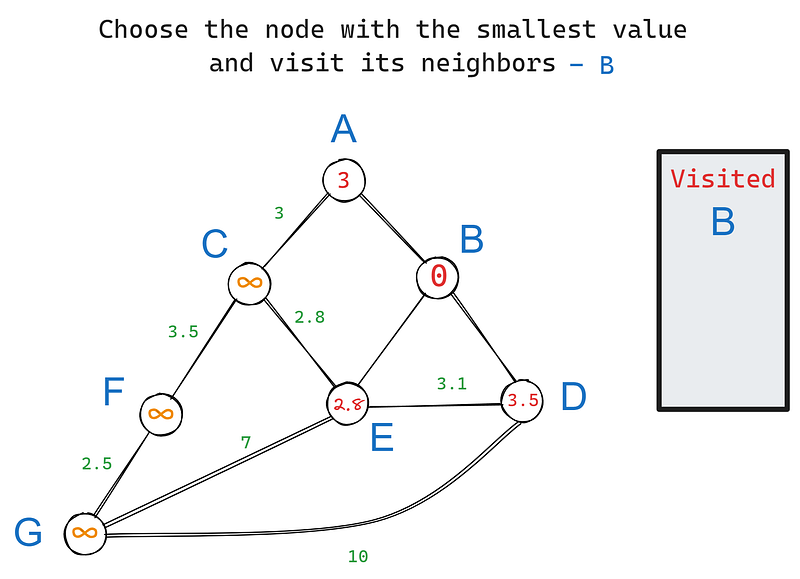
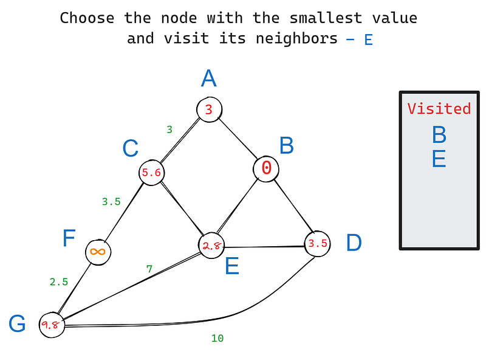
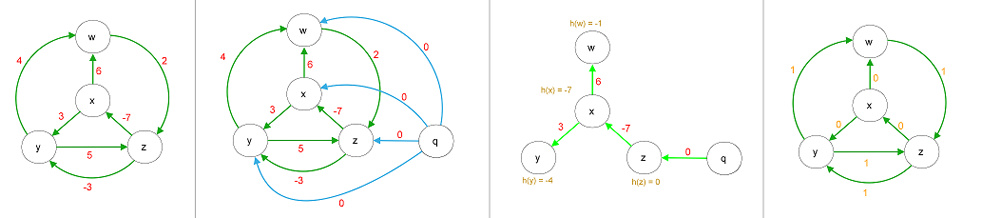

## Análisis de Riesgo

Al realizar este trabajo sobre algoritmos de camino más corto, podría encontrarme con varios problemas que dificulten el desarrollo del proyecto:

1.  **Incompatibilidad de Librerías**: Podría suceder que las versiones de las librerías utilizadas (como `networkx`, `numpy`, `scipy`, etc.) no sean compatibles entre sí, lo que generaría errores difíciles de depurar. Sería crucial asegurarme de que todas las librerías estén actualizadas y sean compatibles.

2.  **Complejidad Computacional**: Al trabajar con grafos grandes, los algoritmos de camino más corto pueden volverse extremadamente lentos y consumir una gran cantidad de memoria. Debería optimizar mi código y considerar el uso de estructuras de datos eficientes para manejar grafos de gran tamaño, aun así existe el riesgo de que mi pc se congele.

3.  **Conversión a PDF**: Pasar un notebook a PDF puede ser tedioso y problemático, especialmente si contiene gráficos y visualizaciones complejas. Debería asegurarme de que todas las celdas se rendericen correctamente y de que el formato final sea legible y profesional.

## Justificación Técnica de Herramientas y Lenguajes

En este proyecto se han utilizado diversas herramientas y lenguajes de programación para abordar el problema de encontrar caminos más cortos en grafos. A continuación, se presenta una justificación técnica de las herramientas y lenguajes empleados:

1.  **Python**:

    -   **Bibliotecas Especializadas**: Python cuenta con una amplia gama de bibliotecas especializadas para el análisis y manipulación de grafos, como `networkx`, `numpy`, `scipy`, y `matplotlib`, que simplifican el desarrollo y la visualización de soluciones.

2.  **NetworkX**:

    -   **Manipulación de Grafos**: es una biblioteca diseñada para la creación, manipulación y estudio de la estructura, dinámica y funciones de grafos complejos. Permite una fácil implementación y análisis de grafos.
    -   **Algoritmos Integrados**: Proporciona una variedad de algoritmos integrados para el análisis de grafos, incluyendo algoritmos de caminos más cortos, lo que facilita la implementación y comparación de diferentes métodos.

3.  **NumPy**:

    -   **Eficiencia Computacional**: `numpy` es una biblioteca fundamental para la computación científica en Python. Proporciona soporte para arrays y matrices multidimensionales, junto con una colección de funciones matemáticas de alto nivel para operar con estos arrays.
    -   **Manejo de Datos**: Facilita el manejo y la manipulación eficiente de grandes conjuntos de datos, lo cual es crucial para el análisis de grafos y la implementación de algoritmos de caminos más cortos.

4.  **SciPy**:

    -   **Algoritmos Avanzados**: es una biblioteca utilizada para la computación científica y técnica. Incluye módulos para la optimización, álgebra lineal, integración, interpolación, funciones especiales, y más.
    -   **Algoritmos de Grafos**: al igual que NetworkX proporciona implementaciones eficientes de algoritmos de caminos más cortos, como Dijkstra, Bellman-Ford, Johnson y Floyd-Warshall, lo que permite comparar el rendimiento y la eficiencia de diferentes métodos.

5.  **Matplotlib**:

    -   **Visualización de Grafos**: `matplotlib` es una biblioteca de Python utilizada para crear visualizaciones estáticas, animadas e interactivas. Se ha utilizado para visualizar los grafos y sus propiedades de manera clara y comprensible.
    -   **Flexibilidad y Personalización**: Permite una gran flexibilidad y personalización en la creación de gráficos, lo que facilita la representación visual de los resultados del análisis de grafos.

6.  **Scribbr Citation Generator**:

    -   **Generación de Citas y Referencias**: Scribbr Citation Generator es una herramienta en línea que facilita la creación de citas y referencias, en este caso Harvard.

7.  **RStudio**:

    -   **Documentación y Reproducibilidad**: Facilita la documentación del flujo de trabajo y ofrece un entorno de desarrollo el cual incluye una consola, editor de sintaxis que apoya la ejecución de código, así como herramientas para el trazado, la depuración y la gestión del espacio de trabajo.

    -   **Exportación**: Permite la creación de documentos `HTML` con tabla de contenidos de aportando muchas opciones de customización pudiendo así facilitar la lectura. Además permite exportarlo a PDF aunque esto empeora la experiencia del usuario.

## Tipos de datos básicos empleados en el proyecto

1.  **lista**: Representa una secuencia de nodos o vértices del grafo.

    -   Ejemplo: vertices = ['A', 'B', 'C']

2.  **diccionario**: Representa un mapa de adyacencia entre los nodos del grafo.

    -   Ejemplo: grafo = {'A': ['B', 'C'], 'B': ['A', 'D'], 'C': ['A', 'F'], 'D': ['B'], 'E': ['F'], 'F': ['C', 'E']}

3.  **set:** Representa un conjunto de nodos o vértices del grafo.

    -   Ejemplo: vertices = {'A', 'B', 'C'}

4.  **tupla:** Similar a la lista, pero inmutable.

    -   Ejemplo: vertices = ('A', 'B', 'C')

5.  **numpy.ndarray**: Representa una matriz de adyacencia entre los nodos del grafo. Tienen la misma función que los arrays normales pero son más veloces y facilitan los calculos con diversas funciones.

    -   Ejemplo: grafo = np.array([[0, 1, 0], [1, 0, 1], [0, 1, 0]])

6.  **scipy.sparse.csr_matrix:** Representa una matriz dispersa en formato CSR (Compressed Sparse Row), que es eficiente para operaciones aritméticas y de almacenamiento.

    -   Ejemplo: matriz_adyacencia = csr_matrix([[0, 1, 0], [1, 0, 1], [0, 1, 0]])

7.  **int:** Representa un número entero.

    -   Ejemplo: num_nodos = 14

  
### Creación de una Matriz de adyacencia y representación gráfica del grafo

Se utlizará para medir el tiempo de ejecución de distintos algoritmos

```{python include=FALSE}
# Importar librerias
import subprocess
import sys

def install(package):
    subprocess.check_call([sys.executable, "-m", "pip", "install", package])

try:
    import numpy as np
except ImportError:
    install('numpy')
    import numpy as np

try:
    import networkx as nx
except ImportError:
    install('networkx')
    import networkx as nx

try:
    import matplotlib.pyplot as plt
except ImportError:
    install('matplotlib')
    import matplotlib.pyplot as plt

try:
    import random
except ImportError:
    install('random')
    import random

try:
    from scipy.sparse import csr_matrix
except ImportError:
    install('scipy')
    from scipy.sparse import csr_matrix
```

```{python}
np.random.seed(2706)

# Crea una gráfica vacía
G = nx.Graph()

# Agrega 20 nodos a la gráfica
for i in range(14):
    G.add_node(i)

# Añade aristas a la gráfica
G.add_edge(0, 3)
G.add_edge(3, 6)
G.add_edge(6, 9)
G.add_edge(9, 10)
G.add_edge(0, 2)
G.add_edge(2, 5)
G.add_edge(5, 8)
G.add_edge(8, 10)
G.add_edge(0, 1)
G.add_edge(1, 4)
G.add_edge(4, 7)
G.add_edge(7, 10)
G.add_edge(3, 6)
G.add_edge(6, 9)
G.add_edge(9, 13)
G.add_edge(13, 10)
G.add_edge(12, 9)
G.add_edge(12, 11)
G.add_edge(11, 10)

# Calcula la matriz de adyacencia actualizada
matriz_adyacencia = nx.to_numpy_array(G)

# Asigna pesos a las aristas de forma sesgada
matriz_adyacencia[matriz_adyacencia == 1] = np.random.randint(1, 5, size=np.count_nonzero(matriz_adyacencia == 1))
matriz_adyacencia[matriz_adyacencia == 0] = np.random.randint(10, 110, size=np.count_nonzero(matriz_adyacencia == 0))
matriz_adyacencia[matriz_adyacencia > 20] = 0
np.fill_diagonal(matriz_adyacencia, 0)

# Cambio el formato de la matriz de adyacencia a una matriz dispersa en formato CSR
matriz_adyacencia = csr_matrix(matriz_adyacencia)

# Crear un grafo desde la matriz de adyacencia
G = nx.from_numpy_array(matriz_adyacencia.toarray())

# Dibujar el grafo con nodos en forma de elipse

fig = plt.figure(figsize=(9, 5))

# Número de nodos
num_nodos = len(G.nodes)

# Calcular las posiciones en forma de elipse
pos = {}
for i in range(num_nodos):
    angle = 2 * np.pi * i / num_nodos
    x = np.cos(angle)  
    y = np.sin(angle)
    pos[i] = (x, y)
    
# Dibujar nodos y aristas
nx.draw(G, pos, with_labels=True, node_color='lightblue', edge_color='darkgrey', node_size=1500, font_size=20)
fig.set_facecolor('#e5e5e5')
# Obtener los pesos de las aristas
edge_labels = nx.get_edge_attributes(G, 'weight')

# Apesar de no tener decimales salen como n.0, los paso a enteros para quitarlo
edge_labels = {key: int(value) for key, value in edge_labels.items()}

# Dibujar los pesos de las aristas
nx.draw_networkx_edge_labels(G, pos, edge_labels=edge_labels,font_color='black', font_size=7,bbox=dict(facecolor='#e5e5e5', edgecolor='darkgrey', boxstyle='round,pad=0.5'))
plt.show()
```

### Creación de una función para desglosar el camino

```{python}
# Función para trazar el camino desde un nodo dado hasta el nodo de inicio utilizando el array de predecesores
def trazar_camino(predecesores, nodo_inicio, nodo_fin):
    camino = []
    nodo_actual = nodo_fin
    while nodo_actual != nodo_inicio:
        camino.append(nodo_actual)
        nodo_actual = predecesores[nodo_actual]
    camino.append(nodo_inicio)
    camino.reverse()
    return camino
```

## Algoritmos de ruta más corta

### Dijkstra con Montículos de Fibonacci

Para esta variante del algoritmo primero se explicará: - La estructura de datos de `Montículos de Fibonacci`, El algoritmo base de `Dijkstra` y finalmente La implementación de `Dijkstra con Montículos de Fibonacci`

#### Montículos de Fibonacci

##### Características

1.  **Árbol binario**: Cada nodo tiene como máximo dos hijos (izquierdo y derecho).

2.  **Completo**: Es un árbol binario completo, lo que significa que todos sus niveles están completamente llenos, excepto el último nivel, que está lleno desde la izquierda a la derecha.

3.  **Raíz**: El nodo raíz es el elemento más grande del montículo.

4.  **Propiedad de Fibonacci**: Para cualquier nodo, la cantidad de nodos en su subárbol izquierdo es igual a la cantidad de nodos en su subárbol derecho, o uno menos.

5.  **Organización de los pesos**: El peso más pequeños se pone a la izquierda y el mayor a la derecha.

    -   **Ejemplo**:

| Peso 1 | Peso 2 | Peso que va a la izquierda |
|:------:|:------:|:--------------------------:|
|   2    |   5    |             2              |
|   1    |   -4   |             -4             |
|   -7   |   -2   |             -7             |


Fuente: [Growingwiththeweb](https://www.growingwiththeweb.com/data-structures/fibonacci-heap/overview/)

##### Insertar

**Paso 1: Verificar si el árbol está vacío**

-   Si el árbol está vacío (no hay nodos), crea un nuevo nodo con el elemento que se desea insertar y establece ese nodo como la raíz del árbol.

**Paso 2: Identificar el lugar correcto para insertar el elemento**

-   Comienza en la raíz del árbol.
-   Mientras que el elemento a insertar es mayor que el valor del nodo actual, sigue hacia la derecha (hacia el hijo derecho).
-   Si el elemento a insertar es menor que el valor del nodo actual, sigue hacia la izquierda (hacia el hijo izquierdo).

**Paso 3: Insertar el elemento en el lugar correcto**

-   Una vez que se ha encontrado el lugar correcto para insertar el elemento, crea un nuevo nodo con ese elemento.
-   Si el lugar correcto es una hoja (un nodo sin hijos), coloca el nuevo nodo allí.

**Paso 4: Reorganizar el árbol si es necesario**

-   Si el nuevo nodo tiene dos hijos, reorganiza el árbol para mantener la propiedad de Fibonacci:
-   Si el nuevo nodo tiene un hijo izquierdo y su subárbol derecho tiene más nodos que su subárbol izquierdo, intercambia los hijos del nuevo nodo.
-   Repite este proceso hasta que se cumpla la propiedad de Fibonacci.

**Paso 5: Actualizar la raíz si es necesario**

-   Si el nuevo nodo se convirtió en la nueva raíz del árbol (es decir, se movió hacia arriba), actualiza la raíz del árbol con el nuevo nodo.

**Complejidad Temporal**

-   $O(1)$, constante.

**Ejemplo:**

Supongamos que tenemos un montículo de Fibonacci vacío y queremos insertar los elementos 5, 3, 7 y 2 en ese orden.

```         
                                             5
                                            / \
                                           3   7
                                          /
                                         2
```

1.  **Insertar 5:**
    -   Crea un nuevo nodo con valor 5 y lo establece como la raíz del árbol.
2.  **Insertar 3:**
    -   Identifica el lugar correcto para insertar 3 (izquierda de 5).
    -   Crea un nuevo nodo con valor 3 y lo coloca en ese lugar.
    -   Reorganiza el árbol: no es necesario porque 3 tiene solo un hijo izquierdo.
3.  **Insertar 7:**
    -   Identifica el lugar correcto para insertar 7 (derecha de 5).
    -   Crea un nuevo nodo con valor 7 y lo coloca en ese lugar.
    -   Reorganiza el árbol: no es necesario porque 7 tiene solo un hijo derecho.
4.  **Insertar 2:**
    -   Identifica el lugar correcto para insertar 2 (izquierda de 3).
    -   Crea un nuevo nodo con valor 2 y lo coloca en ese lugar.
    -   Reorganiza el árbol: no es necesario porque 2 tiene solo un hijo izquierdo.

El resultado final es:

```         
                                            5
                                           / \
                                          3   7
                                         /
                                        2
```

##### Eliminar

**Paso 1: Identificar el nodo a eliminar**

-   Busca el nodo que contiene el elemento que se desea eliminar.

**Paso 2: Verificar si el nodo tiene hijos**

-   Si el nodo a eliminar no tiene hijos, simplemente elimina ese nodo del árbol.
-   Si el nodo a eliminar tiene un hijo izquierdo y un hijo derecho, sigue con el siguiente paso.

**Paso 3: Reemplazar el nodo a eliminar con su hijo derecho**

-   Si el nodo a eliminar tiene un hijo derecho, reemplaza el nodo a eliminar con su hijo derecho.
-   Si el nodo a eliminar no tiene un hijo derecho, pero sí un hijo izquierdo, reemplaza el nodo a eliminar con su hijo izquierdo.

**Paso 4: Reorganizar el árbol si es necesario**

-   Si se reemplazó el nodo a eliminar con su hijo derecho o izquierdo, puede que sea necesario reorganizar el árbol para mantener la propiedad de Fibonacci:
-   Si el nuevo nodo tiene un hijo izquierdo y su subárbol derecho tiene más nodos que su subárbol izquierdo, intercambia los hijos del nuevo nodo.
-   Repite este proceso hasta que se cumpla la propiedad de Fibonacci.

**Paso 5: Actualizar la raíz si es necesario**

-   Si el nuevo nodo se convirtió en la nueva raíz del árbol (es decir, se movió hacia arriba), actualiza la raíz del árbol con el nuevo nodo.

**Complejidad temporal**

$O(log V)$, donde $V$ es el número de nodos en el árbol. Esto se debe a que el árbol está ordenado, lo que hace que la búsqueda sea muy eficiente.

**Ejemplo**

Supongamos que tenemos un montículo de Fibonacci con los nodos 5, 3, 7 y 2 en ese orden y queremos eliminar el elemento 3.

**Paso 1: Identificar el nodo a eliminar**

-   El nodo 3 es el que se desea eliminar.

**Paso 2: Verificar si el nodo tiene hijos**

-   El nodo 3 tiene un hijo izquierdo (el nodo 2).

**Paso 3: Reemplazar el nodo a eliminar con su hijo derecho**

-   No hay un hijo derecho para el nodo 3, pero sí un hijo izquierdo (el nodo 2). Sin embargo, no se reemplaza el nodo 3 con el nodo 2 porque el nodo 2 tiene un hijo izquierdo. En lugar de eso, se sigue con el siguiente paso.

**Paso 4: Reorganizar el árbol si es necesario**

-   El nuevo nodo (el nodo 2) tiene un hijo izquierdo y su subárbol derecho tiene más nodos que su subárbol izquierdo. Se intercambian los hijos del nuevo nodo para mantener la propiedad de Fibonacci.

**Paso 5: Actualizar la raíz si es necesario**

-   No hay necesidad de actualizar la raíz porque el nuevo nodo (el nodo 2) no se convirtió en la nueva raíz.

Resultado Intermedio:

```         
                                            5
                                           / \
                                          7   2
                                         /
                                        3
```

Sin embargo, como queremos eliminar el elemento 3, seguimos con los pasos restantes.

**Paso 6: Identificar el nodo a eliminar**

-   El nodo 3 es el que se desea eliminar

**Paso 7: Verificar si el nodo tiene hijos**

-   El nodo 3 no tiene hijos

**Paso 8: Reemplazar el nodo a eliminar con su hijo derecho**

-   No hay un hijo derecho para el nodo 3, por lo que simplemente se elimina el nodo 3 del árbol.

Resultado final:

```         
                                            5
                                           / \
                                          7   2
```

En resumen, la eliminación de un elemento en un montículo de Fibonacci implica reemplazar el nodo a eliminar con su hijo derecho o izquierdo y luego reorganizar el árbol para mantener la propiedad de Fibonacci.

##### Ventajas

1.  **Búsqueda eficiente**: La búsqueda es muy rápida debido a la estructura del árbol binario completo.
2.  **Inserción y eliminación eficientes**: Estas operaciones se realizan en tiempo $O(log n)$, lo que es más rápido que en otros tipos de árboles binarios.
3.  **Estructura compacta**: Reduce el uso de memoria.

##### Desventajas

1.  **Complejidad de implementación**: Puede ser más costoso de implementar que otros tipos de árboles binarios.
2.  **Requerimientos de mantenimiento**: Requiere un mantenimiento constante para asegurarse de que está correctamente ordenado.

#### Dijkstra

##### Características

1.  **Aplicabilidad**: Funciona en grafos dirigidos y no dirigidos.
2.  **Pesos Positivos**: Solo funciona con grafos que tienen pesos no negativos en las aristas.
3.  **Complejidad Temporal**: $O(V^2)$, donde $V$ es el número de vértices en el grafo.

##### Pasos

1.  **Inicialización**:

    -   Establece la distancia al nodo origen como 0 y a todos los demás nodos como infinito.
    -   Marca todos los nodos como no visitados. Establece el nodo origen como el nodo actual.

2.  **Selección del Nodo Actual**:

    -   Selecciona el nodo no visitado con la distancia más pequeña como el nodo actual.

    

    Fuente: [Datacamp](https://www.datacamp.com/tutorial/dijkstra-algorithm-in-python)

3.  **Actualización de Distancias**:

    -   Para el nodo actual, considera todos sus vecinos no visitados y calcula sus distancias tentativas.
    -   Compara la distancia recién calculada con la distancia actual asignada y asigna el menor valor.

    

    Fuente: [Datacamp](https://www.datacamp.com/tutorial/dijkstra-algorithm-in-python)

4.  **Marcar Nodo como Visitado**:

    -   Una vez considerados todos los vecinos del nodo actual, marca el nodo actual como visitado. Un nodo visitado no será revisado nuevamente.

    

    Fuente: [Datacamp](https://www.datacamp.com/tutorial/dijkstra-algorithm-in-python)

5.  **Repetición**:

    -   Si el nodo destino ha sido marcado como visitado o si la distancia más pequeña entre los nodos no visitados es infinita, el algoritmo termina.
    -   De lo contrario, selecciona el nodo no visitado con la distancia más pequeña, establece este nodo como el nuevo nodo actual y repite el proceso.\
        \
        Fuente: [Wikipedia](https://es.wikipedia.org/wiki/Algoritmo_de_Dijkstra)

**Ejemplo**

**Encontrar la ruta más corta entre nodos A y C utilizando el Algoritmo Dijkstra**

|       |  A  |  B  |  C  |  D  |  E  |
|:-----:|:---:|:---:|:---:|:---:|:---:|
| **A** |  0  |  2  |  ∞  |  ∞  |  5  |
| **B** |  2  |  0  |  ∞  |  3  |  ∞  |
| **C** |  ∞  |  ∞  |  0  |  2  |  4  |
| **D** |  ∞  |  3  |  2  |  0  |  ∞  |
| **E** |  5  |  ∞  |  4  |  ∞  |  0  |

**Paso 1: Inicialización**

-   Creamos un conjunto de nodos visitados vacío, llamado V.
-   Creamos una tabla de distancias desde el nodo A, donde la distancia del nodo A a sí mismo es 0 y todas las demás distancias son infinitas.
-   Creamos una tabla de nodos previos, que contendrá la ruta más corta desde el nodo A hasta cada nodo.

| Nodo | Distancia |
|------|-----------|
| A    | 0         |
| B    | ∞         |
| C    | ∞         |
| D    | ∞         |
| E    | ∞         |

**Paso 2: Selección del nodo con la distancia más pequeña**

-   El nodo con la distancia más pequeña desde el nodo A es el nodo B, con una distancia de 2.
-   Agregamos el nodo B al conjunto de nodos visitados (V = {B}).

**Paso 3: Actualización de distancias**

-   La distancia del nodo C desde el nodo A no se puede calcular directamente a partir de las distancias conocidas.
-   La distancia del nodo D desde el nodo A es la suma de la distancia del nodo B a sí mismo y la distancia del nodo B al nodo D, que es 2 + 3 = 5.
-   La distancia del nodo E desde el nodo A es 5 ya que hay arista directa

| Nodo | Distancia |
|------|-----------|
| A    | 0         |
| B    | 2         |
| C    | ∞         |
| D    | 5         |
| E    | 5         |

**Paso 4: Selección del nodo con la distancia más pequeña**

-   El nodo con la distancia más pequeña desde el nodo A es el nodo B, con una distancia de 2.
-   Agregamos el nodo B al conjunto de nodos visitados (V = {B}).

**Paso 5: Actualización de distancias**

-   La distancia del nodo C desde el nodo A es la suma de la distancia del nodo D a sí mismo y la distancia del nodo D al nodo C, que es ∞ + 2 = 2.
-   La distancia del nodo E desde el nodo A sigue siendo 5.

| Nodo | Distancia |
|------|-----------|
| A    | 0         |
| B    | 2         |
| C    | 2         |
| D    | 5         |
| E    | 5         |

**Paso 6: Selección del nodo con la distancia más pequeña**

-   El nodo con la distancia más pequeña desde el nodo A ahora es el nodo C, con una distancia de 2.
-   Agregamos el nodo C al conjunto de nodos visitados (V = {B, C}).

La ruta más corta del Nodo A al C utilizando el Algoritmo Dijkstra es:

1.  A → B
2.  B → D
3.  D → C

La distancia total es 2 + 3 + 2 = 7.

##### Pseudocódigo

**Algoritmo Dijkstra**

**Entrada:**

-   `G`: Grafo dirigido ponderado, donde cada arista tiene un peso (coste) asociado.
-   `s`: Nodo inicial (fuente).
-   `nodos`: Conjunto de nodos del grafo.

**Salida:**

-   `distancias`: Arreglo que almacena la distancia mínima desde el nodo `s` a cada uno de los demás nodos en el grafo.

-   `predecesores`: Arreglo que almacena el predecesor de cada nodo en el camino más corto desde el nodo `s`.

**Inicialización**

-   `distancias[s] = 0` (la distancia desde el nodo `s` a sí mismo es 0).
-   Para cada nodo `u` en `nodos`, excepto `s`:
    -   `distancias[u] = ∞` (la distancia desde el nodo `s` al nodo `u` no se conoce aún).
    -   `predecesores[u] = null` (no hay predecesor conocido para el nodo `u` en el camino más corto desde el nodo `s`).

**Bucle**

-   Mientras haya nodos que no han sido visitados:
    -   Selecciona el nodo `u` con la distancia mínima desde el nodo `s` (es decir, `distancias[u]` es la menor entre todas las distancias conocidas hasta ahora).
    -   Para cada arista `(u, v)` en el grafo que sale del nodo `u`:
        -   Calcula la distancia `d` desde el nodo `s` al nodo `v` a través del nodo `u`: `d = distancias[u] + peso(arista (u, v))`.
        -   Si esta distancia `d` es menor que la distancia conocida hasta ahora para el nodo `v`, actualiza:
            -   `distancias[v] = d`
            -   `predecesores[v] = u` (actualiza el predecesor del nodo `v` en el camino más corto desde el nodo `s`).

###### Implementación en Python

```{python}
print("Camino más corto: ",nx.shortest_path(G, source=0, target=13, weight='weight', method='dijkstra'))

print("Distancia: ",nx.shortest_path_length(G, source=0, target=13, weight='weight', method='dijkstra'))
```

#### Implementación de Dijkstra en Montículos de Fibonacci

El algoritmo de Dijkstra es un método eficiente para encontrar el camino más corto entre dos nodos en un grafo ponderado. Sin embargo, cuando se trata con grandes conjuntos de datos, la complejidad del algoritmo puede aumentar significativamente debido a la necesidad de mantener una cola de prioridades ordenada.

**Implementación en el Algoritmo de Dijkstra**

Para implementar montículos de Fibonacci en el algoritmo de Dijkstra, podemos utilizarlos para mantener la cola de nodos a visitar. En lugar de utilizar una cola estándar, utilizamos un montículo de Fibonacci que ordena los nodos según su distancia estimada (distancia mínima conocida hasta ese punto).

**Ventajas**

La implementación de montículos de Fibonacci en el algoritmo de Dijkstra ofrece varias ventajas:

-   **Menor complejidad temporal**: $O(V^2)$ → $O(V \log V + E)$.

    -   $V$ es el número de vértices en el grafo.

    -   $E$ es el número de aristas en el grafo.

-   **Reduce la memoria**: Utiliza menos memoria que una cola estándar, ya que solo se necesitan mantener los nodos en el montículo.

##### Diagrama de Flujo

](imagenes/Diagrama%20de%20flujo%20Dijkstra%20Fibo.png)

##### Pseudocódigo con Complejidad Temporal

**Algoritmo de Dijkstra con Montículo de Fibonacci**

**Entradas:**

-   `grafo`: el grafo que se desea buscar
-   `origen`: el nodo de origen

**Salidas:**

-   `distancias`: un arreglo que almacena las distancias mínimas desde el nodo de origen hasta cada uno de los nodos del grafo
-   `predecesores`: un arreglo que almacena los predecesores de cada uno de los nodos del grafo

**Pseudocódigo**

1.  **Iniciar**: crear un objeto vacío para almacenar las distancias (`distancias`) y los predecesores (`predecesores`)
2.  **Insertar el nodo origen en el montículo de Fibonacci**:
    -   Llamar a la función `insertar_en_montículo(origen, raíz)` para insertar el nodo origen en el montículo de Fibonacci (complejidad temporal $O(\log V)$)
3.  **Iterar hasta que se encuentre el destino o se vacíe el montículo**:
    -   Mientras el montículo no esté vacío y el nodo actual no sea el destino:
        -   Extraer el nodo con la distancia mínima del montículo (`nodo_minimo`)
        -   Si el nodo extraído es el destino, terminar la búsqueda
4.  **Actualizar las distancias y predecesores**:
    -   Para cada vecino `vecino` de `nodo_minimo` que no haya sido visitado antes:
        -   Calcular la distancia desde el origen hasta `vecino` a través de `nodo_minimo`
        -   Si esta distancia es menor que la distancia actual almacena en `distancias[vecino]`, actualizar `distancias[vecino]` y `predecesores[vecino]`
5.  **Insertar los vecinos no visitados en el montículo de Fibonacci**:
    -   Para cada vecino `vecino` de `nodo_minimo` que no haya sido visitado antes:
        -   Llamar a la función `insertar_en_montículo(vecino, raíz)` para insertar el vecino en el montículo de Fibonacci (complejidad temporal $O(\log V)$)
6.  **Iterar sobre las aristas del grafo**:
    -   Para cada arista `(u, v)` en el grafo:
        -   Si `distancias[u] + peso(u, v)` es menor que la distancia actual almacena en `distancias[v]`, actualizar `distancias[v]` y `predecesores[v]`
7.  **Devolver**: devolver las distancias (`distancias`) y los predecesores (`predecesores`)

**Complejidad temporal**

Es $O(V \log V + E)$ porque se repite el proceso de extraer el nodo con la distancia más pequeña del montículo de Fibonacci un número igual al número de nodos en el grafo ($V$), lo que tiene una complejidad temporal de $O(\log V)$, y se actualizan las distancias y predecesores de los nodos incidentes a cada arista, lo que tiene una complejidad temporal de $O(E)$.

###### Implementación en Python

```{python}
from scipy.sparse.csgraph import dijkstra

# Utiliza el algoritmo de Dijkstra a través de scipy
dist_matrix, predecessors = dijkstra(matriz_adyacencia, directed=False,indices = 0, return_predecessors=True)

# Ruta del nodo 0 al 13
camino = trazar_camino(predecessors, 0, 13)

print("El camino desde el nodo 0 hasta el nodo 13 es:", camino)
print("La distancia mínima entre el nodo 0 y el nodo 13 es:", dist_matrix[13])
```

### Bellman Ford

#### Características

1.  **Aplicabilidad**: El algoritmo Bellman-Ford se aplica a grafos dirigidos con pesos negativos, ya que no puede manejar aristas con pesos negativos en grafos no dirigidos.
2.  **Pesos Negativos**: Puede manejar grafos con pesos negativos en las aristas.
3.  **Complejidad Temporal**: Tiene una complejidad temporal de $O(VE)$
4.  **Detección de Ciclos Negativos**: Puede detectar la presencia potencial de ciclos de peso negativo en el grafo.
5.  **Distancias Mínimas**: Calcula las distancias mínimas desde un nodo origen a todos los demás nodos, siempre y cuando no haya ciclos de peso negativo.

#### Pasos

**1: Inicialización**

-   Se selecciona un nodo origen en el grafo.
-   Se establece la distancia al nodo origen como $0$, y se establecen las distancias a todos los demás nodos como infinito (representado por un valor muy grande).

**2: Relajación de aristas**

-   El algoritmo repite el siguiente proceso $V-1$ veces, donde $V$ es el número de vértices en el grafo.
-   Para cada vértice $v$:
    -   Se revisan todas las aristas incidentes en $v$, es decir, aquellas que comienzan o terminan en $v$.
    -   Para cada arista $(u,v)$ con peso $w$:
        -   Si la distancia actual a $u$ más el peso de la arista $w$ es menor que la distancia actual a $v$, se actualiza la distancia a $v$.

**3: Detección de ciclos negativos**

-   Después de $V-1$ iteraciones de relaxación de aristas, se revisan todas las aristas una vez más.
-   Para cada arista $(u,v)$ con peso $w$:
    -   Si la distancia actual a u más el peso de la arista w es menor que la distancia actual a $v$, significa que hay un ciclo negativo en el grafo.
    -   En este caso, el algoritmo indica la presencia de un ciclo negativo y no puede garantizar la corrección de las distancias mínimas.

**4: Resultado**

-   Si no se detecta ningún ciclo negativo después de $V-1$ iteraciones de relaxación de aristas más una última revisión, el algoritmo ha encontrado las distancias mínimas desde el nodo origen a todos los demás nodos en el grafo.
-   Las distancias mínimas están almacenadas en la matriz de distancias, que es una tabla que contiene la distancia mínima desde el nodo origen a cada vértice en el grafo.

#### Ejemplo

Supongamos que tenemos el siguiente grafo con 5 nodos:

|       |  A  |  B  |  C  |  D  |  E  |
|:-----:|:---:|:---:|:---:|:---:|:---:|
| **A** |  -  |  6  |  -  |  7  |  -  |
| **B** |  -  |  -  |  5  |  8  | -4  |
| **C** |  -  | -2  |  -  |  -  |  -  |
| **D** |  -  |  -  | -3  |  -  |  9  |
| **E** |  2  |  -  |  7  |  -  |  -  |

1.  **Inicialización**:

    -   Establecer la distancia al nodo origen (A) como 0 y a todos los demás nodos como infinito.
    -   Inicializar la matriz de distancias y predecesores.

    | Nodo | Distancia | Predecesor |
    |------|-----------|------------|
    | A    | 0         | \-         |
    | B    | ∞         | \-         |
    | C    | ∞         | \-         |
    | D    | ∞         | \-         |
    | E    | ∞         | \-         |

2.  **Relajación de aristas**:

    -   Repetir el proceso de relajación para cada arista $V-1$ veces (4 veces en este caso).

    **Iteración 1**:

    -   Relajar arista (A, B): `dist[B] = min(∞, 0 + 6) = 6`
    -   Relajar arista (A, D): `dist[D] = min(∞, 0 + 7) = 7`
    -   Relajar arista (B, C): `dist[C] = min(∞, 6 + 5) = 11`
    -   Relajar arista (B, E): `dist[E] = min(∞, 6 - 4) = 2`
    -   Relajar arista (C, B): `dist[B] = min(6, 11 - 2) = 9`
    -   Relajar arista (D, C): `dist[C] = min(11, 7 - 3) = 4`
    -   Relajar arista (E, A): `dist[A] = min(0, 2 + 2) = 0`

    | Nodo | Distancia | Predecesor |
    |------|-----------|------------|
    | A    | 0         | \-         |
    | B    | 6         | A          |
    | C    | 4         | D          |
    | D    | 7         | A          |
    | E    | 2         | B          |

    **Iteración 2**:

    -   Relajar arista (B, C): `dist[C] = min(4, 6 + 5) = 4`
    -   Relajar arista (B, E): `dist[E] = min(2, 6 - 4) = 2`
    -   Relajar arista (C, B): `dist[B] = min(6, 4 - 2) = 2`
    -   Relajar arista (D, C): `dist[C] = min(4, 7 - 3) = 4`
    -   Relajar arista (E, A): `dist[A] = min(0, 2 + 2) = 0`

    | Nodo | Distancia | Predecesor |
    |------|-----------|------------|
    | A    | 0         | \-         |
    | B    | 2         | C          |
    | C    | 4         | D          |
    | D    | 7         | A          |
    | E    | 2         | B          |

    **Iteración 3**:

    -   Relajar arista (B, C): `dist[C] = min(4, 2 + 5) = 4`
    -   Relajar arista (B, E): `dist[E] = min(2, 2 - 4) = -2`
    -   Relajar arista (C, B): `dist[B] = min(2, 4 - 2) = 2`
    -   Relajar arista (D, C): `dist[C] = min(4, 7 - 3) = 4`
    -   Relajar arista (E, A): `dist[A] = min(0, -2 + 2) = 0`

    | Nodo | Distancia | Predecesor |
    |------|-----------|------------|
    | A    | 0         | \-         |
    | B    | 2         | C          |
    | C    | 4         | D          |
    | D    | 7         | A          |
    | E    | -2        | B          |

    **Iteración 4**:

    -   Relajar arista (B, C): `dist[C] = min(4, 2 + 5) = 4`
    -   Relajar arista (B, E): `dist[E] = min(-2, 2 - 4) = -2`
    -   Relajar arista (C, B): `dist[B] = min(2, 4 - 2) = 2`
    -   Relajar arista (D, C): `dist[C] = min(4, 7 - 3) = 4`
    -   Relajar arista (E, A): `dist[A] = min(0, -2 + 2) = 0`

    | Nodo | Distancia | Predecesor |
    |------|-----------|------------|
    | A    | 0         | \-         |
    | B    | 2         | C          |
    | C    | 4         | D          |
    | D    | 7         | A          |
    | E    | -2        | B          |

3.  **Detección de ciclos negativos**:

    -   Revisar todas las aristas una vez más para detectar ciclos negativos. Si se puede relajar alguna arista, entonces hay un ciclo negativo.

4.  **Resultado**:

    -   La matriz de distancias mínimas desde el nodo origen (A) a todos los demás nodos es:

    | Nodo | Distancia | Predecesor |
    |------|-----------|------------|
    | A    | 0         | \-         |
    | B    | 2         | C          |
    | C    | 4         | D          |
    | D    | 7         | A          |
    | E    | -2        | B          |

#### Implementación en Python

```{python}
#%%timeit
from scipy.sparse.csgraph import bellman_ford

# Utiliza el algoritmo de Bellman-Ford a través de scipy
dist_matrix, predecessors = bellman_ford(matriz_adyacencia, directed=False, indices=0, return_predecessors=True)

# Ruta del nodo 0 al 13
camino = trazar_camino(predecessors, 0, 13)

print("El camino desde el nodo 0 hasta el nodo 13 es:", camino)
print("La distancia mínima entre el nodo 0 y el nodo 13 es:", dist_matrix[13])
```

### Johnson

#### Características

1.  **Aplicabilidad**: El algoritmo de Johnson se aplica a grafos dirigidos **sin ciclos negativos**. Puede manejar grafos no dirigidos transformándolos en dirigidos duplicando las aristas.
2.  **Pesos Positivos y Negativos**: Puede manejar grafos con pesos positivos y negativos en las aristas, siempre y cuando no existan ciclos de peso negativo.
3.  **Complejidad Temporal**: $O(V^2 \log V + VE)$
4.  **Uso de Algoritmos Auxiliares**: Utiliza el algoritmo de Bellman-Ford para reponderar los pesos de las aristas y luego aplica el algoritmo de Dijkstra para encontrar las distancias más cortas desde cada vértice.

#### Pasos

1.  **Añadir nuevo nodo**: Primero se añade un nuevo nodo $q$ al grafo, conectado a cada uno de los nodos del grafo por una arista de peso cero.
2.  **Ejecutar Bellman-Ford**: En segundo lugar, se utiliza el algoritmo de Bellman-Ford, empezando por el nuevo vértice $q$, para determinar para cada vértice $v$ el peso mínimo $h(v)$ del camino de $q$ a $v$. Si en este paso se detecta un ciclo negativo, el algoritmo concluye.
3.  **Modificar pesos**: Seguidamente, a las aristas del grafo original se les cambia el peso usando los valores calculados por el algoritmo de Bellman-Ford: una arista de $u$ a $v$ con peso $w(u, v)$ se transforma a $w(u, v) + h(u) - h(v)$.
4.  **Ejecutar Dijkstra**: Por último, para cada nodo $s$ se usa el algoritmo de Dijkstra (posiblemente con montículos de Fibonacci) para determinar el camino más corto entre $s$ y los otros nodos, usando el grafo con pesos modificados.

 Fuente: [Wikipedia](https://es.wikipedia.org/wiki/Algoritmo_de_Johnson)

#### Ejemplo

Supongamos que tenemos el siguiente grafo con 4 nodos:

|       |  A  |  B  |  C  |  D  |
|:-----:|:---:|:---:|:---:|:---:|
| **A** |  0  |  3  |  0  |  7  |
| **B** |  8  |  0  |  2  |  0  |
| **C** |  5  |  0  |  0  |  1  |
| **D** |  2  |  0  |  0  |  0  |

1.  **Añadir nuevo nodo**:

    -   Añadir un nuevo nodo $q$ conectado a cada uno de los nodos del grafo por una arista de peso cero.

    |       |  A  |  B  |  C  |  D  |  q  |
    |:-----:|:---:|:---:|:---:|:---:|:---:|
    | **A** |  0  |  3  |  ∞  |  7  |  0  |
    | **B** |  8  |  0  |  2  |  ∞  |  0  |
    | **C** |  5  |  ∞  |  0  |  1  |  0  |
    | **D** |  2  |  ∞  |  ∞  |  0  |  0  |
    | **q** |  0  |  0  |  0  |  0  |  0  |

2.  **Ejecutar Bellman-Ford**:

    -   Ejecutar el algoritmo de Bellman-Ford desde el nodo $q$ para determinar los pesos mínimos $h(v)$ desde $q$ a cada nodo $v$.

    | Nodo | h(v) |
    |------|------|
    | A    | 0    |
    | B    | 0    |
    | C    | 0    |
    | D    | 0    |
    | q    | 0    |

3.  **Modificar pesos**:

    -   Modificar los pesos de las aristas usando los valores calculados por Bellman-Ford: $w'(u, v) = w(u, v) + h(u) - h(v)$.

    |       |  A  |  B  |  C  |  D  |
    |:-----:|:---:|:---:|:---:|:---:|
    | **A** |  0  |  3  |  ∞  |  7  |
    | **B** |  8  |  0  |  2  |  ∞  |
    | **C** |  5  |  ∞  |  0  |  1  |
    | **D** |  2  |  ∞  |  ∞  |  0  |

4.  **Ejecutar Dijkstra**:

    -   Ejecutar el algoritmo de Dijkstra desde cada nodo usando los pesos modificados.

    **Desde A**:

    -   Distancias: A: 0, B: 3, C: 5, D: 6

    **Desde B**:

    -   Distancias: A: 8, B: 0, C: 2, D: 3

    **Desde C**:

    -   Distancias: A: 5, B: 8, C: 0, D: 1

    **Desde D**:

    -   Distancias: A: 2, B: 5, C: 7, D: 0

5.  **Resultado**:

    -   La matriz de distancias mínimas entre todos los pares de nodos es:

    |       |  A  |  B  |  C  |  D  |
    |:-----:|:---:|:---:|:---:|:---:|
    | **A** |  0  |  3  |  5  |  6  |
    | **B** |  8  |  0  |  2  |  3  |
    | **C** |  5  |  8  |  0  |  1  |
    | **D** |  2  |  5  |  7  |  0  |

#### Implementación en Python

```{python}
#%%timeit
from scipy.sparse.csgraph import johnson

#Utiliza el algoritmo de Johnson a través de scipy
dist_matrix, predecessors = johnson(matriz_adyacencia ,directed=False, indices=0, return_predecessors=True)

# Ruta del nodo 0 al 13
camino = trazar_camino(predecessors, 0, 13)

print("El camino desde el nodo 0 hasta el nodo 13 es:", camino)
print("La distancia mínima entre el nodo 0 y el nodo 13 es:", dist_matrix[13])
```

### Floyd-Warshall

#### Características

1.  **Aplicabilidad**: Se aplica a grafos dirigidos y no dirigidos.
2.  **Pesos Positivos y Negativos**: Puede manejar grafos con pesos positivos y negativos en las aristas, siempre y cuando no existan ciclos de peso negativo.
3.  **Complejidad Temporal**: $O(V^3)$, donde $V$ es el número de vértices.

#### Pasos

1.  **Inicialización**
    -   Crear una matriz de distancias `dist` donde `dist[i][j]` es la distancia entre el nodo `i` y el nodo `j`. Inicialmente, `dist[i][j]` es el peso de la arista entre `i` y `j` si existe, de lo contrario es infinito. La distancia de un nodo a sí mismo es 0.
2.  **Iteración**
    -   Para cada nodo `k`, actualizar la matriz de distancias considerando `k` como un nodo intermedio. Para cada par de nodos `(i, j)`, actualizar `dist[i][j]` como el mínimo entre `dist[i][j]` y `dist[i][k] + dist[k][j]`.
3.  **Resultado**
    -   Después de completar las iteraciones, la matriz `dist` contendrá las distancias mínimas entre todos los pares de nodos.
4.  **Detección de Ciclos Negativos**
    -   Si `dist[i][i] < 0` para cualquier nodo `i`, entonces el grafo contiene un ciclo de peso negativo.

#### Ejemplo

Supongamos que tenemos el siguiente grafo con 4 nodos:

|       |  A  |  B  |  C  |  D  |
|:-----:|:---:|:---:|:---:|:---:|
| **A** |  -  |  3  |  -  |  7  |
| **B** |  8  |  -  |  2  |  -  |
| **C** |  5  |  -  |  -  |  1  |
| **D** |  2  |  -  |  -  |  -  |

1.  **Inicialización**:

    -   Crear una matriz de distancias `dist` donde `dist[i][j]` es la distancia entre el nodo `i` y el nodo `j`. Inicialmente, `dist[i][j]` es el peso de la arista entre `i` y `j` si existe, de lo contrario es infinito. La distancia de un nodo a sí mismo es 0.

    |       |  A  |  B  |  C  |  D  |
    |:-----:|:---:|:---:|:---:|:---:|
    | **A** |  0  |  3  |  ∞  |  7  |
    | **B** |  8  |  0  |  2  |  ∞  |
    | **C** |  5  |  ∞  |  0  |  1  |
    | **D** |  2  |  ∞  |  ∞  |  0  |

2.  **Iteración**:

    -   Para cada nodo `k`, actualizar la matriz de distancias considerando `k` como un nodo intermedio. Para cada par de nodos `(i, j)`, actualizar `dist[i][j]` como el mínimo entre `dist[i][j]` y `dist[i][k] + dist[k][j]`.

    **Iteración con k = A (k = 0)**:

    -   No hay cambios ya que `dist[i][j]` no se puede mejorar usando el nodo A como intermedio.

    **Iteración con k = B (k = 1)**:

    -   Actualizar `dist[A][C]` como `min(∞, 3 + 2) = 5`
    -   Actualizar `dist[A][D]` como `min(7, 3 + ∞) = 7`
    -   Actualizar `dist[B][D]` como `min(∞, 0 + ∞) = ∞`
    -   Actualizar `dist[C][B]` como `min(∞, ∞ + 0) = ∞`
    -   Actualizar `dist[D][B]` como `min(∞, ∞ + 8) = ∞`

    |       |  A  |  B  |  C  |  D  |
    |:-----:|:---:|:---:|:---:|:---:|
    | **A** |  0  |  3  |  5  |  7  |
    | **B** |  8  |  0  |  2  |  ∞  |
    | **C** |  5  |  ∞  |  0  |  1  |
    | **D** |  2  |  ∞  |  ∞  |  0  |

    **Iteración con k = C (k = 2)**:

    -   Actualizar `dist[A][D]` como `min(7, 5 + 1) = 6`
    -   Actualizar `dist[B][D]` como `min(∞, 2 + 1) = 3`
    -   Actualizar `dist[C][A]` como `min(5, 0 + 5) = 5`
    -   Actualizar `dist[D][A]` como `min(2, ∞ + 2) = 2`
    -   Actualizar `dist[D][B]` como `min(∞, ∞ + 8) = ∞`

    |       |  A  |  B  |  C  |  D  |
    |:-----:|:---:|:---:|:---:|:---:|
    | **A** |  0  |  3  |  5  |  6  |
    | **B** |  8  |  0  |  2  |  3  |
    | **C** |  5  |  ∞  |  0  |  1  |
    | **D** |  2  |  ∞  |  ∞  |  0  |

    **Iteración con k = D (k = 3)**:

    -   Actualizar `dist[A][B]` como `min(3, 6 + ∞) = 3`
    -   Actualizar `dist[A][C]` como `min(5, 6 + ∞) = 5`
    -   Actualizar `dist[B][A]` como `min(8, 3 + 2) = 5`
    -   Actualizar `dist[B][C]` como `min(2, 3 + ∞) = 2`
    -   Actualizar `dist[C][A]` como `min(5, 1 + 2) = 3`
    -   Actualizar `dist[C][B]` como `min(∞, 1 + ∞) = ∞`
    -   Actualizar `dist[D][A]` como `min(2, 0 + 2) = 2`
    -   Actualizar `dist[D][B]` como `min(∞, 0 + ∞) = ∞`
    -   Actualizar `dist[D][C]` como `min(∞, 0 + ∞) = ∞`

    |       |  A  |  B  |  C  |  D  |
    |:-----:|:---:|:---:|:---:|:---:|
    | **A** |  0  |  3  |  5  |  6  |
    | **B** |  8  |  0  |  2  |  3  |
    | **C** |  5  |  8  |  0  |  1  |
    | **D** |  2  |  5  |  7  |  0  |

3.  **Resultado**:

    -   Después de completar las iteraciones, la matriz `dist` contendrá las distancias mínimas entre todos los pares de nodos.

4.  **Detección de Ciclos Negativos**:

    -   Si `dist[i][i] < 0` para cualquier nodo `i`, entonces el grafo contiene un ciclo de peso negativo.
        -   En este caso todas las distancias son positivas por lo que no hay ciclos negativos.

#### Implementación en Python


Fuente: [Wikipedia](https://es.wikipedia.org/wiki/Algoritmo_de_Floyd-Warshall)

```{python}
from scipy.sparse.csgraph import floyd_warshall

#Utiliza el algoritmo de Floyd-Warshall a través de scipy
#Nota: Este algoritmo no permite calcular la distancia eligiendo un nodo de inicio

dist_matrix, predecessors = floyd_warshall(matriz_adyacencia, unweighted=False, directed=False, return_predecessors=True)

# Ruta del nodo 0 al 13
camino = trazar_camino(predecessors[0], 0, 13)

print("El camino desde el nodo 0 hasta el nodo 13 es:", camino)
print("La distancia mínima entre el nodo 0 y el nodo 13 es:", dist_matrix[0, 13])
```

## Elección final de Algoritmo de camino más corto

He elegido el algoritmo de Dijkstra con Monticulos de Fibonacci.

**Razones:**

1. **Eficiencia**: El algoritmo de Dijkstra es muy eficiente para grafos con pesos positivos. Su complejidad temporal es $O(V \log V + E)$, lo que lo hace adecuado para grafos grandes.

2. **Optimización**: Dijkstra está específicamente optimizado para encontrar la ruta más corta desde un solo origen a un solo destino, lo que se ajusta perfectamente al problema de encontrar la ruta más corta en un mapa.

3. **Uso de Pesos Positivos**: Dado que el grafo representa un mapa solo tendrá pesos positivos, Dijkstra es ideal ya que está diseñado para manejar este tipo de grafos sin problemas.

## Bibliografía

### Montículos de Fibonacci
- Colaboradores de Wikipedia (2024) Montículo de Fibonacci. <https://es.wikipedia.org/wiki/Mont%C3%ADculo_de_Fibonacci>.
- Fibonacci heap (2018). <https://www.growingwiththeweb.com/data-structures/fibonacci-heap/overview/>.
- Michael Sambol (no date) Fibonacci Heaps <https://www.youtube.com/playlist?list=PL9xmBV_5YoZNkwWDXcSiZjMgacw2P0U2j>.

### Algoritmo de Dijkstra
- *shortest_path — NetworkX 3.4.2 documentation* (no date). <https://networkx.org/documentation/stable/reference/algorithms/generated/networkx.algorithms.shortest_paths.generic.shortest_path.html#networkx.algorithms.shortest_paths.generic.shortest_path.>
- *shortest_path_length — NetworkX 3.4.2 documentation* (no date). <https://networkx.org/documentation/stable/reference/algorithms/generated/networkx.algorithms.shortest_paths.generic.shortest_path_length.html#networkx.algorithms.shortest_paths.generic.shortest_path_length.>

### Algoritmo de Bellman-Ford
- M, G.P. (2023) Explicación de algoritmos y estructuras de datos de grafos con Ejemplos en Java y C++. <https://www.freecodecamp.org/espanol/news/explicacion-de-algoritmos-y-estructuras-de-datos-de-grafos-con-ejemplos-en-java-y-c/>.
- bellman_ford — SciPy v1.14.1 Manual (no date). <https://docs.scipy.org/doc/scipy/reference/generated/scipy.sparse.csgraph.bellman_ford.html#scipy.sparse.csgraph.bellman_ford>.
- Bellman-Ford Algorithm (no date). <https://www.geeksforgeeks.org/bellman-ford-algorithm-dp-23/>.
- Michael Sambol (2015) Bellman-Ford in 4 minutes — Theory. https://www.youtube.com/watch?v=9PHkk0UavIM.

### Algoritmo de Johnson
- colaboradores de Wikipedia (2020) Algoritmo de Johnson. <https://es.wikipedia.org/wiki/Algoritmo_de_Johnson>.
- johnson — SciPy v1.14.1 Manual (no date). <https://docs.scipy.org/doc/scipy/reference/generated/scipy.sparse.csgraph.johnson.html#scipy.sparse.csgraph.johnson>.
- Basics Strong (2023) Jhonson’s algorithm explained. https://www.youtube.com/watch?v=MV7EAD9zL64.

### Algoritmo de Floyd-Warshall
- colaboradores de Wikipedia (2020) Algoritmo de Floyd-Warshall. <https://es.wikipedia.org/wiki/Algoritmo_de_Floyd-Warshall>.
- floyd_warshall — SciPy v1.14.1 Manual (no date). <https://docs.scipy.org/doc/scipy/reference/generated/scipy.sparse.csgraph.floyd_warshall.html#scipy.sparse.csgraph.floyd_warshall>.
- Michael Sambol (2016) Floyd–Warshall algorithm in 4 minutes. https://www.youtube.com/watch?v=4OQeCuLYj-4.
